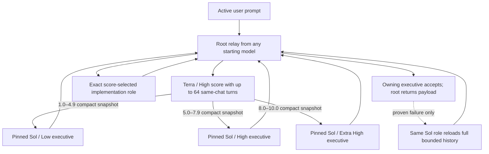

# Codex Orchestration

Codex Orchestration saves Codex credits by moving implementation to the least expensive
capable model while keeping every acceptance decision with GPT-5.6 Sol: Low below 5.0,
High from 5.0–7.9, and Extra High at 8.0 and above.

The 0.8.0 release uses a minimal, recent-context fast path. The manifest does not
advertise a skill, so no Orchestration skill or versioned skill locator is injected
into a new task. Activation does not scan the transcript before every tool, construct
a handoff summary, or call a finish-time receipt tool. Terra / High scores the complete
task once, then applies the fixed seven implementation lanes.

## Runtime architecture

The active path is intentionally small:

1. A stable user-level, once-per-prompt hook checks one chat-local boolean.
2. The user-selected root model immediately gives the current request and up to 64 recent turns from that
   chat only to Terra / High. It uses an explicit numeric fork rather than the unsupported literal
   full-history fork, so a correction can retain the preceding active-request turn.
3. Terra assigns one immutable one-decimal complexity score from 1.0 to 10.0.
4. Terra returns a score protocol containing one root-visible checkpoint plus an internal,
   immutable acceptance contract (outcome, requirements, prohibitions, destinations, and proof).
   Before any further spawn, root relays the exact checkpoint while keeping the contract internal.
5. Scores below 5.0 use a pinned Sol / Low executive. Scores from 5.0–7.9 use Sol / High;
   scores of 8.0 or higher use Sol / Extra High. Those Sol
   executives receive Terra's exact score/status/acceptance snapshot and the current request, without
   inheriting the large parent transcript, so any user-selected starting model is safe.
6. The mapped Sol executive copies Terra's agent/task immediately and may add only a `NONE`
   or 60-word decision directive.
   Root gives the original task context and immutable acceptance contract
   directly to the mapped producer using Terra's immutable agent and task identity, then relays
   its structured implementation evidence for one independent acceptance check. The producer
   reports evidence against the contract but cannot redefine the acceptance criteria.
   If that compact executive proves a takeover is needed, root creates one same-role takeover
   review with the full bounded chat history. It reconciles the active request with the named
   failure evidence before the user-selected root finishes; this history load never occurs on
   the normal acceptance path.
   A failed access method is not a failed outcome: acceptance retries through an available
   authoritative read-only runtime path and never performs a mutation reserved for user approval.
   Acceptance is one batched task-tool call, with one fallback call only when the first access path
   is unavailable. Routine non-experience acceptance uses code, tests, and deployed revision state.
   When the requested outcome is a user-facing interaction, demo, rendered result, or recovery flow,
   the executive requests one exact root verification. The root uses its Browser/visual capability
   and returns named starting-condition, action, result, and artifact observations to the same compact
   Sol executive. HTTP 200, asset presence, text, revisions, and tests are supporting evidence, not substitutes.
7. Root—not the executive—always appends the final executive route, implementation route,
   and immutable complexity lines, including after terminal takeover.

The selected implementation role performs the work itself and is forbidden from creating
Recon, reviewer, helper, replacement, or any other nested subagent. The user-selected root
alone performs the exact executive and implementation relays. No executive rewrites the
user's request, workflow, deployment instructions, or acceptance criteria into a duplicated
implementation packet.

When the task is specifically about Codex Orchestration but a ChatGPT project mirror contains
only its project metadata, the implementation role resolves the configured `codex-orchestration`
marketplace source and uses it only when it is an existing Git checkout. An empty mirror alone is
not a checkout failure or a reason to trigger root takeover.

For example, the top-level task may show `Complexity 2.7 → GPT-5.6 Luna / Max. Updating
the homepage, then committing, deploying, and checking the live site.` This adds one
short handoff message rather than duplicating every nested progress update.

Executive task labels explicitly include `Executive`, and implementation labels include
`Implementation`, so Terra / High scoring and Terra / High implementation cannot collide.
Labels also show the exact selected model and effort, including Sol / Extra High.
Native subagent chip avatars are rendered by the Codex host. The plugin's supported agent metadata
does not include an avatar, icon, or color field, so routing intentionally makes no attempt to
override or imitate them.

The numeric implementation ladder is monotonic:

| Complexity | Implementation |
|---|---|
| 1.0–2.9 | Luna / Max |
| 3.0–5.0 | Terra / Medium |
| 5.1–6.5 | Terra / High |
| 6.6–7.2 | Sol / Low |
| 7.3–7.9 | Sol / Medium |
| 8.0–8.9 | Sol / High |
| 9.0–10.0 | Sol / Extra High |

A fully specified repository catch-up, commit, push, SSH deployment, and live
verification is a routine release workflow: routine deployment does not increase the
implementation score. Unexpected failures and newly unresolved production decisions
still return to the owning Sol executive.

The producer treats deployment as single-owner work. It inspects the documented helper once,
uses the narrowest supported service set, and resumes that exact deployment to terminal exit.
It never starts a competing build, adds `--no-cache` while a deploy is active, or runs the
deploy helper's seed, migration, or backfill steps in parallel.

Terra and the mapped implementation agent inherit up to 64 recent turns from the current chat only;
they never import history from another chat. The initial Sol executive deliberately receives
no parent-history fork because Terra's exact score/status/acceptance snapshot already resolves the route and
active milestone. Only a takeover review reloads the same Sol role with the full bounded history.
Additions, corrections, answers, and permissions amend unfinished inherited work;
only explicit cancellation or replacement discards that objective. This bounded numeric history
avoids the unsupported literal full-history fork. The router does not
reconstruct requirements into a lossy packet, so active corrections, constraints,
permissions, and repository context stay available to the selected model.



The producer self-checks code, configuration, schema, tests, and the deployed revision or artifact,
then returns a bounded `IMPLEMENTATION_RESULT` containing state, per-criterion observations,
revision, tests, deployment, live probe, and incomplete work. The owning executive judges that
evidence against Terra's original acceptance contract and independently checks actual state once,
in one batched task-tool call. The producer never defines or changes what counts as done.
If the requested end state already exists everywhere required, that is a successful no-op: no new
diff, commit, or deployment is required. A revision identifies the current state, not necessarily
the commit that introduced it, so acceptance checks the revision tree and deployed artifact rather
than demanding the behavior appear in that revision's patch. If the acceptance call is malformed
or returns no diagnostic observation, the executive corrects it with the single fallback call;
that is not evidence against the producer's result and cannot create speculative corrective work.
For frontend work without an experience claim, deployed code containing the requested change is
sufficient. When the contract depends on interaction, appearance, a demo, or a recovery flow, the
executive asks the root for one bounded Browser/visual check and judges the returned observations.
A damage-and-recovery demo must prove
that the starting input actually manifests damage and that the recovered output succeeds; an HTTP
response, asset, button label, or passing test alone cannot establish that. If acceptance finds any
mistake, incomplete work, failed verification, missing evidence, or needed correction,
Orchestration enters one full-history, same-Sol-role takeover review. That review can accept when
the inherited context resolves the apparent mismatch; otherwise it returns a context-aware
remaining-work brief. The user-selected root model then announces takeover, reconciles the actual
state, and finishes the whole request directly with no more handoffs. The takeover footer reports the exact active root model and effort from the task context,
not a generic default-model label. There is no correction, reviewer, replacement-producer, or
escalation loop.

## Controls

Activate a chat with any command below, either by itself or at the start of an
imperative sentence that also contains work:

- `Turn Orchestration on`
- `Use Orchestration`
- `Use Orchestration for this chat`

Activation persists only in that chat. Use `Turn Orchestration off` or
`Orchestration off` to disable it. Combined forms such as `Turn Orchestration on,
remove the hero subtitle` activate and route the same prompt; combined off commands
disable routing and continue the remaining work directly. Every new chat starts off.
Control commands can follow another sentence in the same paragraph; for example,
`Fix the demo. Turn Orchestration off.` disables routing while root handles the fix directly.

Activation is handled only by the prompt hook. The dispatch contract explicitly
forbids checking, comparing, or updating Orchestration during user work; a
version-looking cache directory is a compatibility locator, not version evidence.

When the user adds or corrects instructions while work is running, steering remains in
the same task. Root first stops the direct Orchestration child so it cannot delegate
again, then drains the entire active branch from the deepest running descendant upward
and confirms that none remains before routing the revised request. Unrelated agent
branches are left alone. The newest instruction is authoritative while compatible
earlier constraints remain in force, and Terra assigns a fresh score for the revised
task. Because no completed side effect is rolled back, the replacement agent first
reconciles the actual files, Git, remote, and deployed state before continuing.

## Usage measurement

Every completed task reports the observed executive and implementation lanes:

```text
Executive route: GPT-5.6 Sol / Low
Implementation route: GPT-5.6 Terra / Medium
Complexity: 3.8/10
```

The root formats these three final lines from Terra's immutable score and status protocol.
They do not depend on either executive remembering to include them.

There is deliberately no automatic savings receipt. Producing one requires transcript
discovery and pricing work, while Stop enforcement requires another model
continuation. A post-wait hook also runs after timed-out waits, so it can repeat that
cost while an agent is still working. All of those operations are excluded from the
runtime path.

For an explicit diagnostic, the bundled receipt helper can still produce a
weekly-calibrated comparison or an official-rate fallback:

```text
Estimated task credits: 20.000 credits
All-Sol equivalent credits: 50.000 credits
Estimated routing savings: 60.00%
```

The diagnostic uses recorded task and descendant usage. Same-token public pricing cannot
prove the savings from Sol Low versus Sol Medium or Sol High because hidden reasoning
credits are not fully observable. The receipt therefore does not claim that equal
public rates mean equal actual credit consumption.

## Offline routing evaluation

`scripts/triage-cases.json` is a release-time calibration set for representative route
boundaries. It is intentionally separate from the live scoring prompt.
The runtime never reads the offline routing benchmark, so it adds zero task latency and zero task tokens.

## Install from GitHub

Requirements:

- Current Codex CLI or ChatGPT desktop app with plugins and native subagents enabled.
- Access to the GPT-5.6 Sol, Terra, and Luna lanes used by the role templates.
- `jq` and `ripgrep` (`rg`) for installation and verification scripts.

Add the repository as a marketplace and install the plugin:

```sh
codex plugin marketplace add jessejaffe/codex-orchestration --ref main
codex plugin add codex-orchestration@codex-orchestration
```

Install the twelve native companion roles separately. The installer never overwrites a
different user-owned role file:

```sh
plugin_dir="$(codex plugin list --json | jq -r '.installed[] | select(.pluginId == "codex-orchestration@codex-orchestration") | .source.path')"
sh "$plugin_dir/scripts/install-agents.sh"
sh "$plugin_dir/scripts/install-agents.sh" --check
```

Install the single stable user-level hook. The installer preserves unrelated hooks,
copies the two tiny runtime files to `~/.codex/orchestration`, and records trust only
for the exact installed definition:

```sh
python3 "$plugin_dir/scripts/install-user-hook.py" --plugin-dir "$plugin_dir"
python3 "$plugin_dir/scripts/install-user-hook.py" --check --plugin-dir "$plugin_dir"
```

Open one new task after this first install so Codex includes the user config layer.
Later releases update the scripts behind the same trusted command path, so existing
Orchestration-capable tasks and every new task use the current code without a desktop
restart, settings navigation, skill reload, or version check during user work.

## Upgrade safely

From a repository checkout, run:

```sh
python3 ~/.codex/skills/.system/plugin-creator/scripts/update_plugin_cachebuster.py plugins/codex-orchestration
sh plugins/codex-orchestration/scripts/verify.sh
sh plugins/codex-orchestration/scripts/reinstall-plugin.sh
sh plugins/codex-orchestration/scripts/reinstall-plugin.sh --check
```

Every update uses a unique cache-busted version such as
`0.8.0+codex.20260805152715`. This is the supported mechanism that prevents a newly
created task from retaining stale plugin metadata. The reinstaller requires the
complete package, installs that exact version, retains complete compatibility cache
aliases, unconditionally clears orphaned legacy plugin enablement, and refuses unsafe
or incomplete cache entries. It then atomically refreshes the stable user-level hook
runtime and proves that the exact hook is enabled and trusted. The plugin itself no
longer bundles a versioned hook, and the installer checks the user hook from both the
plugin project and a separate user scope. The running desktop's plugin registry cannot
leave new tasks on an older routing definition.

The updater never opens settings, sends keystrokes, steals focus, or restarts Codex.
Once the stable hook definition is installed, later releases keep that definition and
replace only the script it calls. There is no update-time desktop refresh and no
runtime version-discovery step.

## Measure effectiveness

The on-demand receipt is a narrow same-token counterfactual. For longitudinal account
measurement, establish a baseline:

```sh
plugin_dir="$(codex plugin list --json | jq -r '.installed[] | select(.pluginId == "codex-orchestration@codex-orchestration") | .source.path')"
python3 "$plugin_dir/scripts/effectiveness-tracker.py" baseline
```

Later, report the experiment:

```sh
python3 "$plugin_dir/scripts/effectiveness-tracker.py" report
```

The tracker preserves compatibility with the former `sol_advisor_completion_metrics`
schema. Experiment state lives under Codex state, not inside the replaceable plugin
cache.

## Development

The repository verifier runs syntax, role-pin, hook behavior, latency-budget,
continuity, telemetry-migration, safe-installer, and offline-boundary tests:

```sh
sh plugins/codex-orchestration/scripts/verify.sh
```

The prompt hook has a 3.0 KB injected-context ceiling and the hermetic latency test gives
its subprocess a generous 100 ms average CI budget. These are release checks only;
they are not additional runtime work.

## Repository

- Maintained repository: `jessejaffe/codex-orchestration`
- Original project: `DannyMac180/sol-advisor`
- License: MIT
