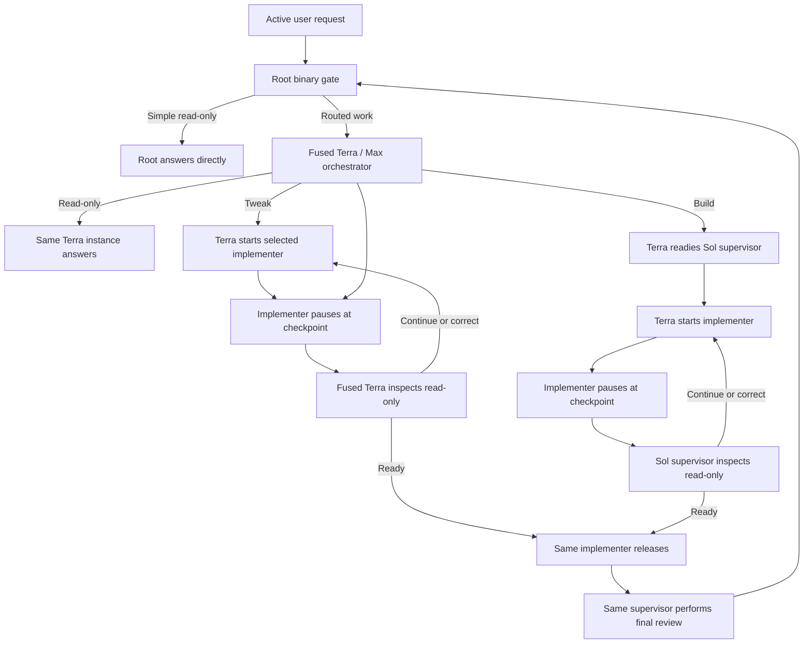

# Codex Orchestration

Codex Orchestration routes Codex work by job type and keeps implementation separate from read-only
review. Version `0.8.17` answers ordinary read-only follow-ups directly in root, while mutation,
fresh verification, audits, and substantial research still route through one Terra / Max
orchestrator. This preserves the standard service tier and removes classification and subagent
overhead from questions the current conversation can already answer.

The five work classes are `READ_ONLY`, `SMALL_TWEAK`, `BIG_TWEAK`, `SMALL_BUILD`, and `BIG_BUILD`.
Complexity may still be estimated for telemetry, but it never selects a model.

## How 0.8.17 works

1. The stable chat-scoped hook gives root a binary gate, the current request, the latest bounded
   acceptance or completion capsule, and a bounded window of newer conversation.
2. Root answers a simple explanation, summary, status, rationale, or brief brainstorming/planning
   request directly when it needs no mutation, tools, fresh verification, audit, or substantial
   research. It does not announce classification or start an agent on that fast path.
3. All other work starts one fused Terra / Max orchestrator. Terra classifies once and owns the
   downstream subtree. For routed `READ_ONLY` work, that same Terra instance answers silently with
   one final result. For tweaks, it remains the supervisor and starts the selected implementer.
4. For builds, Terra starts the Sol supervisor inside its own subtree. The supervisor first compares
   the concrete acceptance, destination, and open commitments with the exact user request and recent
   conversation. An implementer starts only after that independent scope check passes. Checkpoint
   and review turns remain serial.
5. The implementer pauses at route-specific, quiescent checkpoints. The supervisor then inspects
   the actual diff, tests, and runtime state with read-only tools. Terra explicitly reactivates the
   idle child for every checkpoint, decision, final review, and verification handoff. Implementer
   checkpoints use a compact routing header followed by readable Markdown sections for state,
   changes, evidence, next work, and blockers. Supervisor readiness and decisions use the same
   pattern: a compact routing header followed by readable acceptance, findings, corrections, and
   evidence sections.
6. The supervisor returns `CONTINUE`, `CORRECT`, or `READY_TO_RELEASE`. Every correction goes to the
   same implementer; the supervisor never edits or takes over.
7. After release, the same supervisor performs final review. Terra synthesizes the accepted
   implementation, release, and direct-experience evidence into a readable completion report and a
   bounded internal continuity capsule. Root relays every user-facing heading, link, and line
   unchanged and never implements or judges work.

For routed work, the parent reports meaningful milestones only: classification start; the work class with the
combined implementation and supervisor-ready state; each supervisor `CONTINUE`, `CORRECT`, or
`READY_TO_RELEASE` decision; a blocker; and completion. Routine waiting, protocol repair, contract
construction, and final review stay silent. As in the final cache-busted 0.8.0 release, the parent
waits until an agent update instead of polling every 45 seconds. The wait returns immediately when
an update arrives; its timeout is only a safety ceiling, so elapsed time never creates a progress
message. Downstream implementer and Sol-supervisor activity stays nested beneath Terra rather than
being started in the parent task.

The old headless shell process and one-use request-token bridge are retired in 0.8.7. That bridge was
the cause of the 0.8.6 failure mode: a long-running classifier returned a live process handle that
the relay discarded, so valid late output looked like an empty routing result. Fused routing removes
that handoff entirely rather than merely extending its timeout.

## Work classes and routes

| Work class | Definition | Implementer | Read-only supervisor | Checkpoints |
|---|---|---|---|---|
| `READ_ONLY` | Fresh verification, audit, substantial research, or a read-only request root cannot answer directly | Same fused Terra / Max role | None | None |
| `SMALL_TWEAK` | Change one existing behavior in one production component | Luna / Max | Same fused Terra / Max role | Release candidate |
| `BIG_TWEAK` | Change existing behavior across two or more components or an interface boundary | Terra / Max | Same fused Terra / Max role | Root cause, release candidate |
| `SMALL_BUILD` | Add one capability in at most two components with settled architecture | Terra / Max | Sol / High | Design, release candidate |
| `BIG_BUILD` | Add multiple capabilities, use three or more components, cross a runtime boundary, carry material risk, or require unresolved architecture | Sol / High | Sol / Extra High | Architecture, vertical slice, release candidate |

A production component is an independently owned runtime, service, package, executable, UI surface,
data model, or external integration. Tests, documentation, generated metadata, and routine release
steps do not add to the component count.

A tweak repairs or refines an existing capability. A build introduces a net-new capability. A new
release containing a feature is a build; a version-only or cache-only release change is a tweak.
When the boundary is genuinely ambiguous, the router chooses the larger class.



## Context continuity

The router classifies the relationship between the new prompt and unfinished work as `NEW`,
`AMEND`, `REPLACE`, or `CANCEL`. Additions, corrections, answers, permissions, and questions amend
the active objective. An interrupted turn stops execution, not the objective. Replacement or
cancellation requires an explicit signal in the newest user request.

The hook passes the latest bounded acceptance contract and a short recent-conversation window
instead of replaying a large parent transcript. A newer direct conversation marks an older
completion capsule stale, and Terra must prioritize the newer agreement. Commands such as “do the
next step” must resolve to an exact action in that context; repository plans cannot fill in a
missing referent. Terra validates concrete outcomes, destinations, proof, and open commitments
before dispatch. The accepted contract stays immutable through implementation and supervision.

When work completes, Terra records a private one-line capsule containing the outcome, delivered
capabilities, decisive proof, exact links, revision, open commitments, next work, and limitations.
A request such as “summarize what you just built” is answered directly by root from the conversation
or capsule unless the user explicitly asks for fresh verification. `Remaining: None` is permitted
only when every explicit commitment has decisive completion proof.

## Checkpoint and correction protocol

An implementer checkpoint reports its phase, cumulative state, changed files and behavior, actual
evidence, next work, and blockers. Before yielding, the implementer stops active editing, testing,
building, deployment, and migration processes.

The supervisor may then inspect the repository and runtime read-only. A correction must name an
observed mismatch and give bounded, outcome-focused instructions. The fused orchestrator relays that
exact decision to the same implementer. Only `READY_TO_RELEASE` at the release-candidate checkpoint
authorizes the implementer to commit, push, deploy, and probe.

## UI and experience verification

Frontend files do not automatically trigger visual review. For ordinary UI work whose acceptance
does not depend on rendered behavior, the supervisor uses the narrowest decisive code, test,
artifact, runtime, and deployed-revision evidence and does not invent a visual criterion.

Terra prefixes acceptance proof with `ROOT_EXPERIENCE:` when the defining outcome depends on a
user-facing interaction, demo, rendered appearance, visual claim, recovery input/output, a
user-reported rendered mismatch, or an explicit visual-review request. That contract requires one
bounded root-only Browser/visual check against the live URL or rendered artifact, cache-bypassed and
at the relevant viewport when applicable. The
check records the defining `START`, exact `ACTION`, observed `RESULT`, and `ARTIFACTS`, then returns
those raw observations to the same supervisor. HTTP status, assets, DOM text, source code, revision
identity, and passing tests are supporting evidence only and cannot substitute for the defining
experience. Root performs the check but never judges acceptance.

## Controls

Activate one task with any of:

- `Turn Orchestration on`
- `Use Orchestration`
- `Use Orchestration for this chat`

Use `Turn Orchestration off` or `Orchestration off` to disable it. Combined commands such as
`Turn Orchestration on and add CSV export` activate and route that same prompt. Each new task starts
with Orchestration off.

Subagents share a parent session identifier, so the hook checks transcript role metadata and never
recursively orchestrates an Orchestration child.

### Existing-task activation

After installing 0.8.17, Orchestration can be activated on the next prompt inside an ongoing task.
Root uses the fused custom Terra profile when the task exposes it; otherwise it starts a pinned
built-in Terra / Max agent and directs it to the installed fused profile. Inside that subtree, Terra
uses each current custom lane when available and otherwise a pinned built-in `default` or `worker`
identity with the complete 0.8.17 role rules. It never tries an unavailable or legacy identity.

The fused classifier is pinned to GPT-5.6 Terra with Max reasoning and the normal service tier. It
does not opt into Fast mode, so routing does not consume Fast-mode credits. Six companion profiles
cover the fused Terra role, three implementer lanes, and two Sol supervisor lanes.

## Final completion receipt

Every accepted result ends with an orchestrator-authored Markdown report that root relays
unchanged. A build report summarizes the delivered outcome, lists the major changes, records
decisive test and deployment evidence, describes the actual root-only Browser/visual observations
when required, and preserves exact live-site and GitHub links. It also includes the released
revision, remaining limitations, and route metadata. Small tweaks and read-only tasks use the same
shape with fewer bullets and omit only sections that genuinely do not apply.

```markdown
## Completed

The export workflow is released and available from the project dashboard.

## What changed

- Added the export flow and downloadable result bundle.
- Added validation that prevents incomplete exports from being published.

## Verification

- The focused and full test suites passed.
- At the requested viewport, root opened the clean dashboard, selected Export, and directly
  observed the completed download state.

## Links

- [Live website](https://example.com/export)
- [GitHub commit](https://github.com/example/project/commit/0123456789abcdef)

## Release

- Revision: `0123456789abcdef`
- Deployment: production is serving the accepted revision.

## Remaining

- None.

## Orchestration

- Work class: SMALL_BUILD
- Supervisor: GPT-5.6 Sol / High
- Implementation: GPT-5.6 Terra / Max
- Root: GPT-5.6 Sol / High
```

The report may include only verified destinations and observations. It cannot say work is live,
deployed, released, or on GitHub without the corresponding exact destination and evidence.

Complexity remains internal diagnostic telemetry. It is not displayed and cannot override the
class route.

## Install from GitHub

Requirements:

- Current Codex CLI or ChatGPT desktop app with plugins and native subagents enabled.
- Access to the GPT-5.6 Sol, Terra, and Luna roles used by the templates.
- `jq`, Python 3, and standard Unix checksum tools.

Add the repository as a marketplace and install the plugin:

```sh
codex plugin marketplace add jessejaffe/codex-orchestration --ref main
codex plugin add codex-orchestration@codex-orchestration
```

Install the six companion profiles:

```sh
plugin_dir="$(codex plugin list --json | jq -r '.installed[] | select(.pluginId == "codex-orchestration@codex-orchestration") | .source.path')"
sh "$plugin_dir/scripts/install-agents.sh"
sh "$plugin_dir/scripts/install-agents.sh" --check
```

The role installer preflights the complete update. It installs the six current profiles, removes
only recognized byte-for-byte obsolete profiles, and refuses to overwrite or delete customized
files. Retired names are cleanup state, not part of the runtime architecture.

Install the stable user-level hook:

```sh
python3 "$plugin_dir/scripts/install-user-hook.py" --plugin-dir "$plugin_dir"
python3 "$plugin_dir/scripts/install-user-hook.py" --check --plugin-dir "$plugin_dir"
```

## Versioning and upgrades

The project uses traditional semantic versions without timestamp suffixes:

- Patch releases (`0.8.16` to `0.8.17`) contain compatible fixes and refinements.
- Minor releases (`0.8.x` to `0.9.0`) add backward-compatible features.
- Major releases change compatibility expectations.

Version `0.8.17` is a normal patch release. The standard checkout workflow is:

```sh
sh plugins/codex-orchestration/scripts/verify.sh
sh plugins/codex-orchestration/scripts/reinstall-plugin.sh
sh plugins/codex-orchestration/scripts/reinstall-plugin.sh --check
```

The reinstaller installs the exact manifest version, refreshes recognized cache copies, updates the
six companion profiles, safely removes recognized obsolete roles and runtime files, updates the
stable user hook, and verifies the installed state. This is a local Codex plugin, so local reinstall
is its deployment; it does not need Hetzner or database access.

## Development

Run the offline release suite with:

```sh
sh plugins/codex-orchestration/scripts/verify.sh
```

The suite validates the manifest, syntax, exact model pins, chat controls, bounded acceptance
continuity, fused nested orchestration, the five-class lane contract, direct built-in fallback,
root-only experience verification, milestone-only progress, same-implementer corrections, fixtures,
effectiveness tracking, and conflict-safe cleanup.

The offline classification fixture is
`plugins/codex-orchestration/scripts/triage-cases.json`. It covers all five classes plus amendment,
replacement, cancellation, and interrupted-work continuity.

## Repository

- Maintained repository: `jessejaffe/codex-orchestration`
- Original project: `DannyMac180/sol-advisor`
- License: MIT
