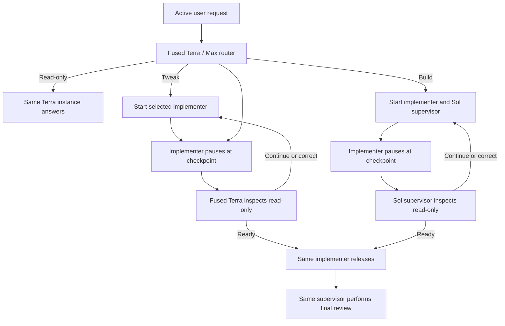

# Codex Orchestration

Codex Orchestration routes Codex work by job type and keeps implementation separate from read-only
review. Version `0.8.8` fuses routing, read-only work, and tweak supervision into one Terra / Max
role. This preserves the standard service tier and avoids starting a second Terra / Max role on the
common paths.

The five work classes are `READ_ONLY`, `SMALL_TWEAK`, `BIG_TWEAK`, `SMALL_BUILD`, and `BIG_BUILD`.
Complexity may still be estimated for telemetry, but it never selects a model.

## How 0.8.8 works

1. The stable chat-scoped hook gives root the current request, the latest unfinished acceptance
   contract, and a fixed routing protocol.
2. Root starts one fused Terra / Max routing supervisor. Its first turn performs classification only
   and returns the four immutable relation, route, status, and acceptance lines.
3. For `READ_ONLY`, that same Terra instance continues and answers the request. For tweak routes,
   it remains the supervisor and root starts only the selected implementer. There is no second Terra
   initialization call.
4. Builds use Terra only for routing, then start the selected implementer and a Sol supervisor. The
   extra handoff is reserved for work complex enough to benefit from the stronger review lane.
5. The implementer pauses at route-specific, quiescent checkpoints. The supervisor then inspects
   the actual diff, tests, and runtime state with read-only tools.
6. The supervisor returns `CONTINUE`, `CORRECT`, or `READY_TO_RELEASE`. Every correction goes to the
   same implementer; the supervisor never edits or takes over.
7. After release, the same supervisor performs final review. Root relays decisions and appends route
   metadata, but never implements or judges the work.

The parent reports meaningful milestones only: classification start; the work class with the
combined implementation and supervisor-ready state; each supervisor `CONTINUE`, `CORRECT`, or
`READY_TO_RELEASE` decision; a blocker; and completion. Routine waiting, protocol repair, and final
review stay silent. As in the final cache-busted 0.8.0 release, the parent waits until an agent
update instead of polling every 45 seconds. The wait returns immediately when an update arrives;
its timeout is only a safety ceiling, so elapsed time never creates a progress message. Desktop
activity headings name the user's concrete outcome rather than role-selection or relay mechanics.

The old headless shell process and one-use request-token bridge are retired in 0.8.7. That bridge was
the cause of the 0.8.6 failure mode: a long-running classifier returned a live process handle that
the relay discarded, so valid late output looked like an empty routing result. Fused routing removes
that handoff entirely rather than merely extending its timeout.

## Work classes and routes

| Work class | Definition | Implementer | Read-only supervisor | Checkpoints |
|---|---|---|---|---|
| `READ_ONLY` | Research, explanation, diagnosis, review, or planning with no mutation | Same fused Terra / Max role | None | None |
| `SMALL_TWEAK` | Change one existing behavior in one production component | Luna / Max | Same fused Terra / Max role | Release candidate |
| `BIG_TWEAK` | Change existing behavior across two or more components or an interface boundary | Terra / Max | Same fused Terra / Max role | Root cause, release candidate |
| `SMALL_BUILD` | Add one capability in at most two components with settled architecture | Terra / Max | Sol / High | Design, release candidate |
| `BIG_BUILD` | Add multiple capabilities, use three or more components, cross a runtime boundary, carry material risk, or require unresolved architecture | Sol / High | Sol / Extra High | Architecture, vertical slice, release candidate |

A production component is an independently owned runtime, service, package, executable, UI surface,
data model, or external integration. Tests, documentation, generated metadata, and routine release
steps do not add to the component count.

A tweak repairs or refines an existing capability. A build introduces a net-new capability. A new
release containing a feature is a build; a version-only or cache-only release change is a tweak.
When the boundary is genuinely ambiguous, the router chooses the larger class.



## Context continuity

The router classifies the relationship between the new prompt and unfinished work as `NEW`,
`AMEND`, `REPLACE`, or `CANCEL`. Additions, corrections, answers, permissions, and questions amend
the active objective. An interrupted turn stops execution, not the objective. Replacement or
cancellation requires an explicit signal in the newest user request.

The hook passes the latest bounded acceptance contract instead of copying a second large recent-chat
transcript into a headless request file. Root validates the four protocol lines and fixed route table
before dispatch. One repair by the same Terra instance is allowed for malformed output. The accepted
contract stays immutable through implementation and supervision.

## Checkpoint and correction protocol

An implementer checkpoint reports its phase, cumulative state, changed files and behavior, actual
evidence, next work, and blockers. Before yielding, the implementer stops active editing, testing,
building, deployment, and migration processes.

The supervisor may then inspect the repository and runtime read-only. A correction must name an
observed mismatch and give bounded, outcome-focused instructions. Root relays that exact decision to
the same implementer. Only `READY_TO_RELEASE` at the release-candidate checkpoint authorizes the
implementer to commit, push, deploy, and probe.

## Controls

Activate one task with any of:

- `Turn Orchestration on`
- `Use Orchestration`
- `Use Orchestration for this chat`

Use `Turn Orchestration off` or `Orchestration off` to disable it. Combined commands such as
`Turn Orchestration on and add CSV export` activate and route that same prompt. Each new task starts
with Orchestration off.

Subagents share a parent session identifier, so the hook checks transcript role metadata and never
recursively orchestrates an Orchestration child.

### Existing-task activation

After installing 0.8.8, Orchestration can be activated on the next prompt inside an ongoing task.
For each lane, the router uses the current custom profile when the task exposes it. Otherwise it
goes directly to Codex's built-in `default` or `worker` identity with the model, reasoning effort,
and complete 0.8.8 role rules set explicitly. It never tries an unavailable or legacy identity.

The fused classifier is pinned to GPT-5.6 Terra with Max reasoning and the normal service tier. It
does not opt into Fast mode, so routing does not consume Fast-mode credits. Six companion profiles
cover the fused Terra role, three implementer lanes, and two Sol supervisor lanes.

## Final route receipt

Every routed result ends with root-authored metadata:

```text
Work class: SMALL_BUILD
Supervisor route: GPT-5.6 Sol / High
Implementation route: GPT-5.6 Terra / Max
Current root route: GPT-5.6 Sol / High
```

Complexity remains internal diagnostic telemetry. It is not displayed and cannot override the
class route.

## Install from GitHub

Requirements:

- Current Codex CLI or ChatGPT desktop app with plugins and native subagents enabled.
- Access to the GPT-5.6 Sol, Terra, and Luna roles used by the templates.
- `jq`, Python 3, and standard Unix checksum tools.

Add the repository as a marketplace and install the plugin:

```sh
codex plugin marketplace add jessejaffe/codex-orchestration --ref main
codex plugin add codex-orchestration@codex-orchestration
```

Install the six companion profiles:

```sh
plugin_dir="$(codex plugin list --json | jq -r '.installed[] | select(.pluginId == "codex-orchestration@codex-orchestration") | .source.path')"
sh "$plugin_dir/scripts/install-agents.sh"
sh "$plugin_dir/scripts/install-agents.sh" --check
```

The role installer preflights the complete update. It installs the six current profiles, removes
only recognized byte-for-byte obsolete profiles, and refuses to overwrite or delete customized
files. Retired names are cleanup state, not part of the runtime architecture.

Install the stable user-level hook:

```sh
python3 "$plugin_dir/scripts/install-user-hook.py" --plugin-dir "$plugin_dir"
python3 "$plugin_dir/scripts/install-user-hook.py" --check --plugin-dir "$plugin_dir"
```

## Versioning and upgrades

The project uses traditional semantic versions without timestamp suffixes:

- Patch releases (`0.8.7` to `0.8.8`) contain compatible fixes and refinements.
- Minor releases (`0.8.x` to `0.9.0`) add backward-compatible features.
- Major releases change compatibility expectations.

Version `0.8.8` is a normal patch release. The standard checkout workflow is:

```sh
sh plugins/codex-orchestration/scripts/verify.sh
sh plugins/codex-orchestration/scripts/reinstall-plugin.sh
sh plugins/codex-orchestration/scripts/reinstall-plugin.sh --check
```

The reinstaller installs the exact manifest version, refreshes recognized cache copies, updates the
six companion profiles, safely removes recognized obsolete roles and runtime files, updates the
stable user hook, and verifies the installed state. This is a local Codex plugin, so local reinstall
is its deployment; it does not need Hetzner or database access.

## Development

Run the offline release suite with:

```sh
sh plugins/codex-orchestration/scripts/verify.sh
```

The suite validates the manifest, syntax, exact model pins, chat controls, bounded acceptance
continuity, fused structured routing, the five-class lane contract, direct built-in fallback,
milestone-only progress, same-implementer corrections, fixtures, effectiveness tracking, and
conflict-safe cleanup.

The offline classification fixture is
`plugins/codex-orchestration/scripts/triage-cases.json`. It covers all five classes plus amendment,
replacement, cancellation, and interrupted-work continuity.

## Repository

- Maintained repository: `jessejaffe/codex-orchestration`
- Original project: `DannyMac180/sol-advisor`
- License: MIT
