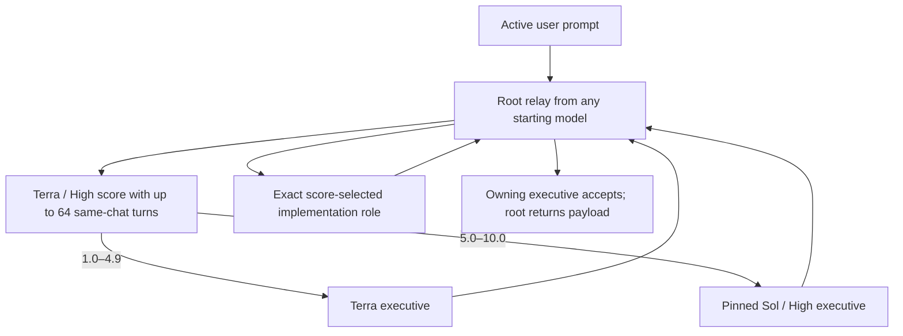

# Codex Orchestration

Codex Orchestration saves Codex credits by moving settled work to the least expensive
capable model while keeping complex executive judgment with GPT-5.6 Sol / High.

The 0.8.0 release uses a minimal, recent-context fast path. The manifest does not
advertise a skill, so no Orchestration skill or versioned skill locator is injected
into a new task. Activation does not scan the transcript before every tool, construct
a handoff summary, or call a finish-time receipt tool. Terra / High scores the complete
task once, then applies the fixed seven implementation lanes.

## Runtime architecture

The active path is intentionally small:

1. A stable user-level, once-per-prompt hook checks one chat-local boolean.
2. The user-selected root model immediately gives the current request and up to 64 recent turns from that
   chat only to Terra / High. The context fork is always partial; on a short chat the one omitted oldest
   task turn is copied verbatim, avoiding Codex's restriction on pinned models with full-history forks.
3. Terra assigns one immutable one-decimal complexity score from 1.0 to 10.0.
4. Terra returns a score protocol containing one root-visible checkpoint; root displays
   it before relaying any planning or implementation work.
5. Scores below 5.0 stay with Terra as executive. Scores of 5.0 or higher go to a
   separately pinned Sol / High executive, so any user-selected starting model is safe.
6. The owning executive returns an execution packet. Root alone spawns the mapped
   producer and relays its result for one acceptance check.

Custom roles never need collaboration tools. The user-selected root performs only exact
spawn and follow-up relays; all scoring, planning, implementation, and acceptance remain
inside pinned roles.

For example, the top-level task may show `Complexity 2.7 → GPT-5.6 Luna / Max. Updating
the homepage, then committing, deploying, and checking the live site.` This adds one
short handoff message rather than duplicating every nested progress update.

Executive task labels explicitly include `Executive`, and implementation labels include
`Implementation`, so Terra / High scoring and Terra / High implementation cannot collide.
Labels also show the exact selected model and effort, including Sol / Extra High.

The numeric implementation ladder is monotonic:

| Complexity | Implementation |
|---|---|
| 1.0–2.9 | Luna / Max |
| 3.0–5.0 | Terra / Medium |
| 5.1–6.5 | Terra / High |
| 6.6–7.2 | Sol / Low |
| 7.3–7.9 | Sol / Medium |
| 8.0–8.9 | Sol / High |
| 9.0–10.0 | Sol / Extra High |

A fully specified repository catch-up, commit, push, SSH deployment, and live
verification is a routine release workflow: routine deployment does not force a Sol
route. Terra / High may perform it directly. Unexpected failures and newly unresolved
production decisions still return to the owning Sol executive when the immutable
score is 5.0 or higher or the task can no longer be completed within its original scope.

Each handoff inherits up to 64 recent turns from the current chat only. It never imports
history from another chat. This bounded history is used because current Codex rejects a
custom-model role combined with a literal full-history fork. The router does not
reconstruct requirements into a lossy packet, so active corrections, constraints,
permissions, and repository context stay available to the selected model.



The producer self-checks and the owning executive checks once. If acceptance finds any
mistake, incomplete work, failed verification, missing evidence, or needed correction,
Orchestration ends immediately. The user-selected root model announces takeover,
reconciles the actual state, and finishes the whole request directly with no more
handoffs. There is no correction, reviewer, replacement-producer, or escalation loop.

## Controls

Activate a chat with any command below, either by itself or at the start of an
imperative line that also contains work:

- `Turn Orchestration on`
- `Use Orchestration`
- `Use Orchestration for this chat`

Activation persists only in that chat. Use `Turn Orchestration off` or
`Orchestration off` to disable it. Combined forms such as `Turn Orchestration on,
remove the hero subtitle` activate and route the same prompt; combined off commands
disable routing and continue the remaining work directly. Every new chat starts off.

Activation is handled only by the prompt hook. The dispatch contract explicitly
forbids checking, comparing, or updating Orchestration during user work; a
version-looking cache directory is a compatibility locator, not version evidence.

When the user adds or corrects instructions while work is running, steering remains in
the same task. Root first stops the direct Orchestration child so it cannot delegate
again, then drains the entire active branch from the deepest running descendant upward
and confirms that none remains before routing the revised request. Unrelated agent
branches are left alone. The newest instruction is authoritative while compatible
earlier constraints remain in force, and Terra assigns a fresh score for the revised
task. Because no completed side effect is rolled back, the replacement agent first
reconciles the actual files, Git, remote, and deployed state before continuing.

## Usage measurement

Every completed task reports the observed executive and implementation lanes:

```text
Executive route: GPT-5.6 Terra / High
Implementation route: GPT-5.6 Terra / Medium
Complexity: 3.8/10
```

There is deliberately no automatic savings receipt. Producing one requires transcript
discovery and pricing work, while Stop enforcement requires another model
continuation. A post-wait hook also runs after timed-out waits, so it can repeat that
cost while an agent is still working. All of those operations are excluded from the
runtime path.

For an explicit diagnostic, the bundled receipt helper can still produce a
weekly-calibrated comparison or an official-rate fallback:

```text
Estimated task credits: 20.000 credits
All-Sol equivalent credits: 50.000 credits
Estimated routing savings: 60.00%
```

The diagnostic uses recorded task and descendant usage. Same-token public pricing cannot
prove the savings from Sol Low versus Sol Medium or Sol High because hidden reasoning
credits are not fully observable. The receipt therefore does not claim that equal
public rates mean equal actual credit consumption.

## Offline routing evaluation

`scripts/triage-cases.json` is a release-time calibration set for representative route
boundaries. It is intentionally separate from the live scoring prompt.
The runtime never reads the offline routing benchmark, so it adds zero task latency and zero task tokens.

## Install from GitHub

Requirements:

- Current Codex CLI or ChatGPT desktop app with plugins and native subagents enabled.
- Access to the GPT-5.6 Sol, Terra, and Luna lanes used by the role templates.
- `jq` and `ripgrep` (`rg`) for installation and verification scripts.

Add the repository as a marketplace and install the plugin:

```sh
codex plugin marketplace add jessejaffe/codex-orchestration --ref main
codex plugin add codex-orchestration@codex-orchestration
```

Install the ten native companion roles separately. The installer never overwrites a
different user-owned role file:

```sh
plugin_dir="$(codex plugin list --json | jq -r '.installed[] | select(.pluginId == "codex-orchestration@codex-orchestration") | .source.path')"
sh "$plugin_dir/scripts/install-agents.sh"
sh "$plugin_dir/scripts/install-agents.sh" --check
```

Install the single stable user-level hook. The installer preserves unrelated hooks,
copies the two tiny runtime files to `~/.codex/orchestration`, and records trust only
for the exact installed definition:

```sh
python3 "$plugin_dir/scripts/install-user-hook.py" --plugin-dir "$plugin_dir"
python3 "$plugin_dir/scripts/install-user-hook.py" --check --plugin-dir "$plugin_dir"
```

Open one new task after this first install so Codex includes the user config layer.
Later releases update the scripts behind the same trusted command path, so existing
Orchestration-capable tasks and every new task use the current code without a desktop
restart, settings navigation, skill reload, or version check during user work.

## Upgrade safely

From a repository checkout, run:

```sh
python3 ~/.codex/skills/.system/plugin-creator/scripts/update_plugin_cachebuster.py plugins/codex-orchestration
sh plugins/codex-orchestration/scripts/verify.sh
sh plugins/codex-orchestration/scripts/reinstall-plugin.sh
sh plugins/codex-orchestration/scripts/reinstall-plugin.sh --check
```

Every update uses a unique cache-busted version such as
`0.8.0+codex.20260805152715`. This is the supported mechanism that prevents a newly
created task from retaining stale plugin metadata. The reinstaller requires the
complete package, installs that exact version, retains complete compatibility cache
aliases, unconditionally clears orphaned legacy plugin enablement, and refuses unsafe
or incomplete cache entries. It then atomically refreshes the stable user-level hook
runtime and proves that the exact hook is enabled and trusted. The plugin itself no
longer bundles a versioned hook, and the installer checks the user hook from both the
plugin project and a separate user scope. The running desktop's plugin registry cannot
leave new tasks on an older routing definition.

The updater never opens settings, sends keystrokes, steals focus, or restarts Codex.
Once the stable hook definition is installed, later releases keep that definition and
replace only the script it calls. There is no update-time desktop refresh and no
runtime version-discovery step.

## Measure effectiveness

The on-demand receipt is a narrow same-token counterfactual. For longitudinal account
measurement, establish a baseline:

```sh
plugin_dir="$(codex plugin list --json | jq -r '.installed[] | select(.pluginId == "codex-orchestration@codex-orchestration") | .source.path')"
python3 "$plugin_dir/scripts/effectiveness-tracker.py" baseline
```

Later, report the experiment:

```sh
python3 "$plugin_dir/scripts/effectiveness-tracker.py" report
```

The tracker preserves compatibility with the former `sol_advisor_completion_metrics`
schema. Experiment state lives under Codex state, not inside the replaceable plugin
cache.

## Development

The repository verifier runs syntax, role-pin, hook behavior, latency-budget,
continuity, telemetry-migration, safe-installer, and offline-boundary tests:

```sh
sh plugins/codex-orchestration/scripts/verify.sh
```

The prompt hook has a 2 KB injected-context ceiling and the hermetic latency test gives
its subprocess a generous 100 ms average CI budget. These are release checks only;
they are not additional runtime work.

## Repository

- Maintained repository: `jessejaffe/codex-orchestration`
- Original project: `DannyMac180/sol-advisor`
- License: MIT
