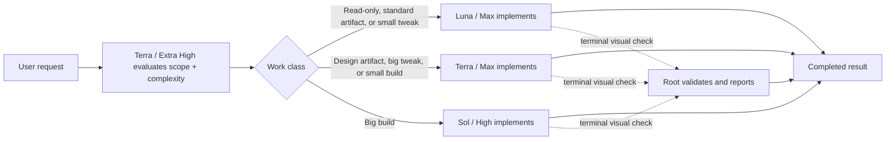

# Codex Orchestration

Codex Orchestration `0.9.0` is an automated, complexity-aware model router for Codex. GPT-5.6
Terra / Extra High evaluates each request's scope and complexity, assigns a work class, and routes
the task to the lightest model lane suited to it. Users get one workflow without having to choose a
different model for every request.

One routed implementer takes the task through implementation, nonvisual verification, and reporting.
When rendered appearance or interaction is part of success, root performs one terminal visual
verification after implementation; for nonvisual work, the implementer's completed report is the
user-facing result.

The default `main` branch is intentionally the stripped-down public distribution: repository
guidance, public documentation and license, the marketplace descriptor, and the installable plugin
package. It excludes synchronized chat or project material, user-specific runtime state, local
caches, credentials, and unrelated development artifacts.

## Workflow



After classification, execution stays with one routed implementer.

## Routes

| Work class | Definition | Implementation lane |
|---|---|---|
| `READ_ONLY` | Research, diagnosis, review, explanation, or status without mutation | Luna / Max |
| `STANDARD_ARTIFACT` | Content- or data-led spreadsheet, document, PDF, or presentation work | Luna / Max |
| `DESIGN_ARTIFACT` | A non-code artifact whose composition, brand, or exact look defines success | Terra / Max |
| `SMALL_TWEAK` | One bounded existing behavior with predictable blast radius | Luna / Max |
| `BIG_TWEAK` | Multiple existing behavior changes, a boundary crossing, or material operational risk | Terra / Max |
| `SMALL_BUILD` | One bounded new capability without a new interface, runtime, or storage boundary | Terra / Max |
| `BIG_BUILD` | Multiple new capabilities, a boundary-crossing capability, or material risk | Sol / High |

The router is automated rather than a manual model picker: Terra uses the request's complexity and
scope to assign a work class, and that class determines the fixed model lane. The numeric complexity
score is diagnostic telemetry; users do not need to interpret it or select a route themselves.

## What happens after routing

The routed implementer receives the exact private task-context bundle and then:

- reads the complete concise whole-chat record and the 20 newest prior task outcomes before
  deciding what other context is needed;
- resolves the requested outcome and constraints, including chat-resident facts;
- inspects the real project state only when the current task needs it;
- uses applicable skills;
- performs the full read-only, artifact, tweak, or build task;
- runs proportionate verification;
- does not fetch, compare remote refs, or check checkout cleanliness at startup merely because a
  later release is expected;
- for implementation plus release, performs one GitHub and relevant-status check after implementation
  and verification, immediately before commit and release; for deployment-only work, that release
  phase starts immediately;
- skips remote Git checks entirely when no commit, push, or deployment is authorized;
- commits, pushes, or deploys only when the user request, project instructions, or active
  continuity clearly authorizes that exact destination;
- writes a natural-language result that explains what happened, what it did or found, the outcome,
  and decisive evidence, then names one real follow-on action or explicitly says that no next step
  is needed.

A request to implement locally does not itself authorize deployment.

User questions and genuine blockers still stop the task when a decision is required. Keeping one
classifier and one routed implementer makes execution predictable and low-latency.

## Deployment discipline

When a task includes an authorized deployment, Codex Orchestration keeps the release as focused as
the change permits:

- It examines the final diff and traces the running services and release jobs that execute the
  changed path. A service is not included merely because it can import the code or shares an image.
  It deploys the smallest safe set, using a full-stack release only for a genuinely cross-service,
  shared-runtime, or infrastructure change.
- It runs migrations, seed jobs, cache warmups, backfills, model downloads, and policy snapshots
  only when the change requires them. Before deploying, it states the service scope and optional
  jobs; afterward, it verifies the exact pushed revision and the affected live path.
- For a deployment-only request, it does not repeat earlier implementation tests. It fetches the
  target ref once, plans from only the final changed-file list or a small diff, and preserves any
  dirty or different local branch by using a clean target worktree. When supported, that uses
  `~/.codex/bin/deploy-from-target-worktree --ref <ref> -- <project deployment command>`.
- It prints the scoped deployment plan before its one production attempt, does not fall back to a
  legacy, mode-less, or full deployment, and opens a database tunnel only when a selected release
  job actually needs one. It reports deployment time separately from readiness verification.
- When asked to set up deployment for a project, it inspects the repository, hosting configuration,
  and existing release scripts itself. It then records a project-specific `AGENTS.md` service/job/
  verification map and provides a deploy script with explicit scope, a no-side-effect plan mode,
  exact-revision execution, and phase timings.

## Visual verification

Root verification is required when the defining outcome depends on rendered appearance, user
interaction, a reported visual mismatch, or explicit visual review—not merely because UI files
changed. The routed implementer prepares an accessible target and returns:

```text
## Root verification needed
- Requirement: ...
- Ground truth: ...
- Source: ...
- Check: ...
- Targets: ...
- Viewport: ...
- State: ...
- Work report: ...
```

Root checks once, validates the rendered result against the request and cited ground truth, and ends
the task with the standard report whether the result passes, fails, or is blocked. It never guesses
an ambiguous identity, description, or link, and never hands the check back for another agent cycle.
The work performed remains the report's primary content; a visual failure is briefly explained after
that work account rather than replacing it.

## Classification and context

The chat-scoped hook writes an immutable, private task-context bundle. It is a concise whole-chat
representation: every user request and substantive root-visible assistant fact in chronological
order, plus canonical outcomes for the 20 newest completed tasks. It deterministically removes
internal transport envelopes, duplicate relays, generic route footers, status-only commentary, and
pathological repeated filler without relying on a model-written summary. Terra / Extra High receives
only bounded routing context and returns:

```text
## Classification
- Relationship: New|Amend|Replace|Cancel
- Active objective: ...
- Work class: Read-only|Standard artifact|Design artifact|Small tweak|Big tweak|Small build|Big build
- Complexity: 1.0-10.0 / 10
- Why: ...
```

When the user explicitly asks to continue a different previous Codex task outside this chat, root
reads it once. The classifier gets a 1,200-character routing capsule and the selected implementer
gets a 6,000-character continuity block. Those cross-task capsules do not limit the concise
whole-chat bundle for the current chat. Missing optional artifacts never block work.

Completed agents report in natural language. The classifier's small state packet retains only the
latest bounded completion context, while the selected implementer receives the complete canonical
bundle—not a current-task excerpt—so a follow-up can use durable chat facts and recent task outcomes
without unnecessary repository inspection. Each report ends with a mandatory Next step section,
followed by a compact route footer naming the work class, selected implementation lane, and root
route.

## Reports

Except for a root-only visual handoff, the final report is the selected agent's completed report,
relayed verbatim to the user. Root does not summarize, condense, or add a second completion response.
It is a natural-language account rather than a fixed Continuity, Completed, Current state, and Next
step template. The account explains what happened, what was done or found, the outcome, and decisive
evidence, with links, limitations, or open work when relevant. The completed user-facing report uses
slightly less technical language for a general reader: it leads with the outcome, prefers familiar
words, and briefly explains unavoidable jargon while preserving useful exact details. This applies
only to the final report; routing, implementation, verification, and agent-to-agent communication
remain as technical as the work requires. Its only required report section is the Next step section
immediately above the route footer.

Every completed report finishes with this mandatory ending:

```text
## Next step
<one legitimate follow-on action, or None — no next step is needed.>

## Route
- Class: <friendly class>
- Implementation: <selected model lane>
- Root: <CURRENT_ROOT_ROUTE>
```

When a real follow-on action exists, the Next step section names it. Otherwise it says exactly
`None — no next step is needed.`; the agent never invents work to fill the required section.

## Premise mismatches

Before editing, the selected agent stops if project evidence contradicts a factual premise in the
request. Root checks only the cited evidence and hands its conclusion back to the same agent. A
confirmed mismatch ends without edits, commit, or deployment; an unconfirmed mismatch resumes in
the same agent thread.

## Activation

Activation is chat-scoped:

```text
Turn Orchestration on
Use Orchestration
Use Orchestration for this chat
```

Disable it with:

```text
Turn Orchestration off
Orchestration off
```

The desktop activity label stays exactly `Thinking`. Startup remains quiet after the activation
acknowledgement; child pills show the classifier and selected agent.

## Install and verify

Install the four companion profiles:

```sh
plugins/codex-orchestration/scripts/install-agents.sh
```

Run the hermetic verification suite:

```sh
plugins/codex-orchestration/scripts/verify.sh
```

Install or refresh the plugin from the configured local marketplace:

```sh
plugins/codex-orchestration/scripts/reinstall-plugin.sh
```

The installer preflights all four active profiles, migrates exact shipped profiles, and refuses to
overwrite customized agent files.

## Repository layout

```text
.agents/plugins/marketplace.json
plugins/codex-orchestration/
  .codex-plugin/plugin.json
  agents/
    codex-orchestration-terra-orchestrator.toml
    codex-orchestration-luna-implementer.toml
    codex-orchestration-terra-implementer.toml
    codex-orchestration-sol-high-implementer.toml
  scripts/
    prompt-router-hook.py
    orchestration_state.py
    install-user-hook.py
    install-agents.sh
    reinstall-plugin.sh
    verify.sh
```

## Background

Codex Orchestration was originally contributed by DannyMac180. We tested more heavily coordinated
multi-agent approaches and kept this distribution focused on automated routing to one implementer
because extra coordination added latency and complexity; at the time of writing, sub-agent handoffs
are not reliable enough to make them part of the default workflow.
