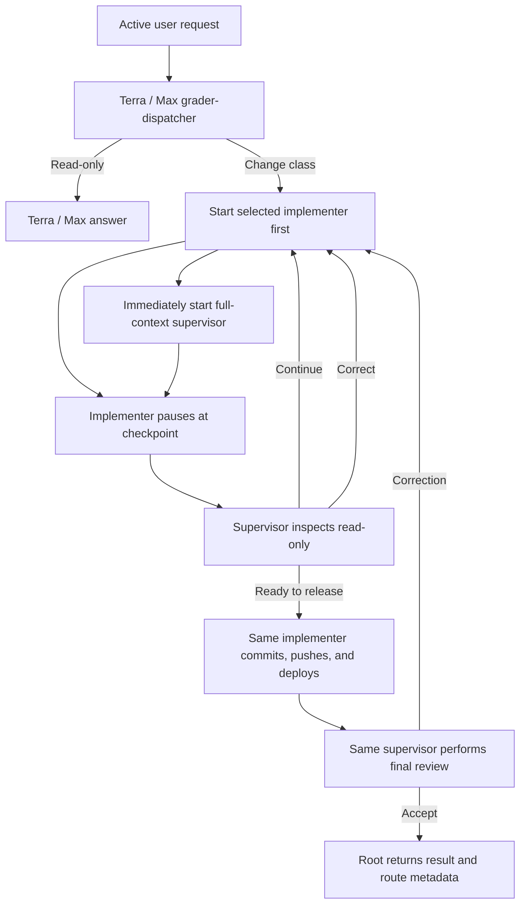

# Codex Orchestration

Codex Orchestration routes Codex work by what kind of job it is, then keeps a read-only supervisor
beside the implementer throughout change work. Version `0.8.2` keeps the five work classes from
0.8.1, makes activation compatible with an old task, and adds visible progress through every phase:
`READ_ONLY`, `SMALL_TWEAK`, `BIG_TWEAK`, `SMALL_BUILD`, and `BIG_BUILD`.

Complexity is still estimated from 1.0 to 10.0 for telemetry, but it does not select a model.

## How 0.8.2 works

1. A stable, chat-scoped prompt hook gives the current request, the latest unfinished acceptance
   contract, and up to 64 same-chat turns to a Terra / Max grader-dispatcher.
2. The grader preserves unfinished work, classifies the active objective, and defines immutable
   acceptance. Root selects compatible agent identities mechanically from the fixed model lanes.
3. For change work, root starts the implementer first and immediately starts the full-context
   supervisor. Both receive the original request and the same immutable grader output.
4. The supervisor's first turn only absorbs context. It does not inspect the worktree while the
   implementer is writing.
5. The implementer pauses at route-specific, quiescent checkpoints. Only then does the supervisor
   inspect the actual diff, tests, and state using read-only tools.
6. The supervisor returns `CONTINUE`, `CORRECT`, or `READY_TO_RELEASE`. The same implementer receives
   every correction and performs it; the supervisor never edits or takes over.
7. After release, the same supervisor performs a final read-only acceptance check. Root relays
   decisions and appends route metadata but never implements or judges the work.

The parent reports when implementation starts, when the supervisor is ready, at every checkpoint,
when a correction returns to the same implementer, during release, and during final verification.
While a child is still working it waits no longer than 45 seconds before posting another useful
status, so the task no longer sits on an unexplained thinking message.

The implementer alone owns edits, tests, commits, pushes, deployments, migrations, and corrections.
This gives the supervisor full task context early without allowing concurrent worktree reads while
files are actively changing.

## Work classes and routes

| Work class | Definition | Implementer | Read-only supervisor | Checkpoints |
|---|---|---|---|---|
| `READ_ONLY` | Research, explanation, diagnosis, review, or planning with no mutation | Terra / Max | None | None |
| `SMALL_TWEAK` | Change one existing behavior in one production component | Luna / Max | Terra / Max | Release candidate |
| `BIG_TWEAK` | Change existing behavior across two or more components or an interface boundary | Terra / Max | Terra / Max | Root cause, release candidate |
| `SMALL_BUILD` | Add one capability in at most two components with settled architecture | Terra / Max | Sol / High | Design, release candidate |
| `BIG_BUILD` | Add multiple capabilities, use three or more components, cross a runtime boundary, carry material risk, or require unresolved architecture | Sol / High | Sol / Extra High | Architecture, vertical slice, release candidate |

A production component is an independently owned runtime, service, package, executable, UI surface,
data model, or external integration. Tests, documentation, generated metadata, and routine release
steps do not add to the component count.

A tweak repairs or refines an existing capability. A build introduces a net-new capability. A new
release containing a feature is a build; a version-only or cache-only release change is a tweak.
When the boundary is genuinely ambiguous, the grader chooses the larger class.



## Context continuity

The grader classifies the relationship between the new prompt and unfinished work as `NEW`,
`AMEND`, `REPLACE`, or `CANCEL`. Additions, corrections, answers, permissions, and questions amend
the active objective. An interrupted turn stops execution, not the objective. Replacement or
cancellation requires an explicit signal from the newest user request.

Root validates the grader's four protocol lines and the fixed route table before dispatch. One
same-grader repair is allowed for malformed output. The original acceptance contract stays
immutable through every implementation and supervision turn.

## Checkpoint and correction protocol

An implementer checkpoint reports its phase, cumulative state, changed files and behavior, actual
evidence, next work, and blockers. Before yielding, the implementer stops active editing, testing,
building, deployment, and migration processes.

The supervisor may then inspect the repository and runtime read-only. A correction must name an
observed mismatch and give bounded, outcome-focused instructions. Root relays that exact decision
to the same implementer. The executive is not working to correct the code and handing it back; the
executive tells the implementer what must be corrected, and the implementer makes the correction.

Only a release-candidate decision of `READY_TO_RELEASE` authorizes the implementer to commit, push,
deploy, and probe. The final review can accept, send another correction to that same implementer, or
request one bounded root-only experience check when the defining outcome is interactive or visual.

## Controls

Activate one chat with any of:

- `Turn Orchestration on`
- `Use Orchestration`
- `Use Orchestration for this chat`

Use `Turn Orchestration off` or `Orchestration off` to disable it. Combined commands such as
`Turn Orchestration on and add CSV export` activate and route that same prompt. Each new chat starts
with Orchestration off.

Subagents share a parent session identifier, so the hook checks transcript role metadata and never
recursively orchestrates an Orchestration child.

### Existing-task activation

After installing 0.8.2, Orchestration can be activated on the next prompt inside an old task; a new
task is not required for each upgrade. The router first reuses stable 0.8.1 identities already in
that task's catalog, then 0.8.0 executive identities, and finally Codex's built-in `default` or
`worker` identity with an explicit model and reasoning pin plus the complete 0.8.2 role contract.
It never waits for an unavailable renamed role or accepts an implicit default Terra selection.

The installer retains eleven identities, including the three 0.8.0 executive names, so tasks opened
from this release onward remain compatible with future contract-only upgrades. A newly installed
user-level hook may still require one new task for Codex to discover the hook itself; once the hook
exists, plugin upgrades apply to existing tasks on their next prompt.

## Final route receipt

Every routed result ends with root-authored metadata:

```text
Work class: SMALL_BUILD
Supervisor route: GPT-5.6 Sol / High
Implementation route: GPT-5.6 Terra / Max
Complexity telemetry: 6.4/10
Current root route: GPT-5.6 Sol / High
```

The complexity value is diagnostic only. It cannot override the class route.

## Install from GitHub

Requirements:

- Current Codex CLI or ChatGPT desktop app with plugins and native subagents enabled.
- Access to the GPT-5.6 Sol, Terra, and Luna roles used by the templates.
- `jq`, Python 3, and standard Unix checksum tools.

Add the repository as a marketplace and install the plugin:

```sh
codex plugin marketplace add jessejaffe/codex-orchestration --ref main
codex plugin add codex-orchestration@codex-orchestration
```

Install the eleven companion roles:

```sh
plugin_dir="$(codex plugin list --json | jq -r '.installed[] | select(.pluginId == "codex-orchestration@codex-orchestration") | .source.path')"
sh "$plugin_dir/scripts/install-agents.sh"
sh "$plugin_dir/scripts/install-agents.sh" --check
```

The role installer preflights the complete migration. It upgrades only recognized shipped files,
retains stable old-task identity names, retires only obsolete byte-for-byte roles, and refuses to
overwrite or delete user-customized files.

Install the stable user-level hook:

```sh
python3 "$plugin_dir/scripts/install-user-hook.py" --plugin-dir "$plugin_dir"
python3 "$plugin_dir/scripts/install-user-hook.py" --check --plugin-dir "$plugin_dir"
```

Open one new task only after the first-ever hook install so Codex includes the user configuration
layer. Normal 0.8.2 and later upgrades can be activated inside an existing task.

## Versioning and upgrades

The project now uses traditional semantic versions without timestamp suffixes:

- Patch releases (`0.8.1` to `0.8.2`) contain compatible fixes and refinements.
- Minor releases (`0.8.x` to `0.9.0`) add backward-compatible features.
- Major releases change compatibility expectations.

Version `0.8.2` is a normal patch release. There is no timestamp cachebuster suffix, and the
cachebuster updater is not part of the release workflow.

From a repository checkout:

```sh
sh plugins/codex-orchestration/scripts/verify.sh
sh plugins/codex-orchestration/scripts/reinstall-plugin.sh
sh plugins/codex-orchestration/scripts/reinstall-plugin.sh --check
```

The reinstaller installs the exact manifest version, refreshes recognized compatibility cache
aliases, migrates the native roles, updates the stable user hook, and verifies the installed state.
Because this is a local Codex plugin, that local reinstall is its deployment; it does not deploy to
an unrelated web server or require database access.

## Development

Run the offline release suite with:

```sh
sh plugins/codex-orchestration/scripts/verify.sh
```

The suite validates the manifest, Python and shell syntax, exact model pins, chat controls, bounded
context continuity, five-class lane contract, old-task fallback selection, visible progress,
implementer-before-supervisor concurrency, same-implementer corrections, fixtures, effectiveness
tracking, and conflict-safe role migration.

The offline classification fixture is
`plugins/codex-orchestration/scripts/triage-cases.json`. It covers all five classes plus amendment,
replacement, cancellation, and interrupted-work continuity.

## Repository

- Maintained repository: `jessejaffe/codex-orchestration`
- Original project: `DannyMac180/sol-advisor`
- License: MIT
