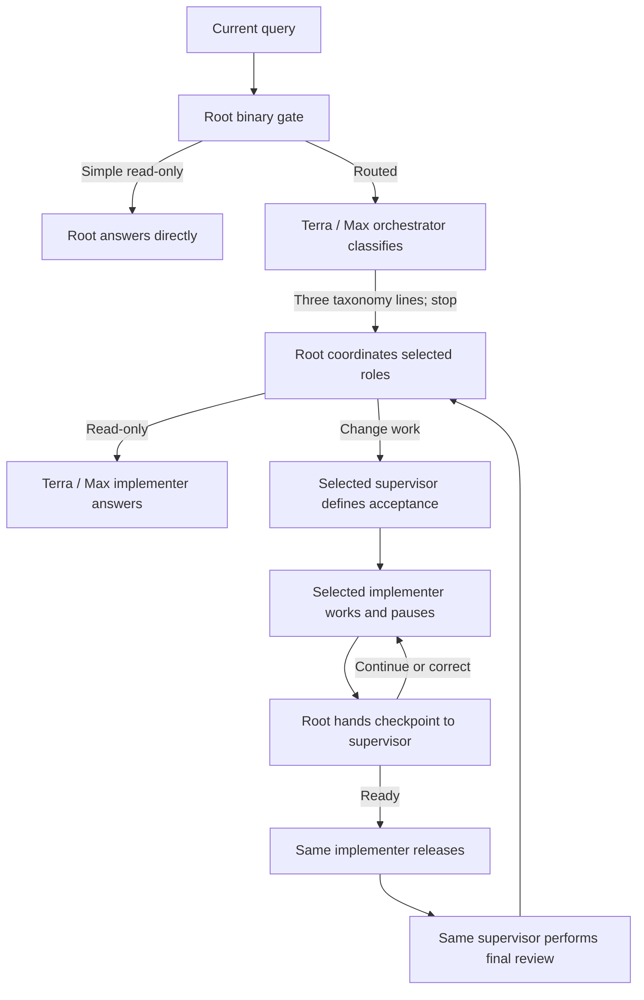

# Codex Orchestration

Codex Orchestration routes Codex work by job type and keeps classification, implementation, and
read-only review as separate roles. Version `0.9.0` makes the Terra / Max orchestrator a taxonomy
orchestrator only. It reads the current query plus bounded conversational continuity, returns the
route to root, and stops. Terra / Max remains independently available as an implementer and as a
supervisor.

The five work classes remain `READ_ONLY`, `SMALL_TWEAK`, `BIG_TWEAK`, `SMALL_BUILD`, and
`BIG_BUILD`. Complexity is diagnostic telemetry; it never selects a model.

## How 0.9.0 works

1. The stable chat-scoped hook gives root a binary gate, the current query, the latest bounded
   acceptance or completion capsule, and a short window of newer conversation. App-injected plugin,
   project-instruction, and environment wrappers are removed from stored user messages.
2. Root answers a simple explanation, summary, status, rationale, or brief brainstorming request
   directly in root when it needs no mutation, tools, fresh verification, audit, or substantial
   research.
3. All other work starts the GPT-5.6 Terra / Max orchestrator on the standard service tier. The
   orchestrator receives only the query and bounded continuity. It does not receive workspace
   dependencies, task-specific skill instructions, repository contents, or a work plan. It calls no
   tools, performs no task work, and returns only the relationship, fixed route, and friendly status.
4. Root validates that fixed route mechanically. Only after classification, root calls the bundled
   workspace dependency loader when spreadsheet, presentation, document, or PDF work needs it. The
   exact executable and package paths go directly to the task roles, never back to the orchestrator.
5. For change work, root starts the selected read-only supervisor first. The supervisor reads the
   detailed request, creates the immutable acceptance contract, and must be ready before root starts
   the implementer. The orchestrator is already finished.
6. Root owns all spawning, waits, checkpoint handoffs, and relays. The implementer and supervisor
   are active serially. The implementer pauses at quiescent checkpoints; root reactivates the
   supervisor for review, then reactivates the same implementer with `CONTINUE`, `CORRECT`, or
   `READY_TO_RELEASE`.
7. The same supervisor performs final review and writes the readable completion report. Root omits
   the private continuity capsule and returns the report unchanged. Root never classifies,
   implements, supervises, or judges acceptance.

For routed work, root reports only meaningful milestones: classification start, implementation and
supervisor readiness, checkpoint decisions, release authorization, blockers, and completion. It
waits until an agent update instead of polling and does not emit elapsed-time heartbeats.

## Work classes and routes

| Work class | Definition | Implementer | Read-only supervisor | Checkpoints |
|---|---|---|---|---|
| `READ_ONLY` | Fresh verification, audit, substantial research, or a read-only request root cannot answer directly | Terra / Max | None | None |
| `SMALL_TWEAK` | Change one existing behavior in one production component | Luna / Max | Terra / Max | Release candidate |
| `BIG_TWEAK` | Change existing behavior across two or more components or an interface/runtime boundary | Terra / Max | Terra / Max | Root cause, release candidate |
| `SMALL_BUILD` | Add one capability in at most two components with settled architecture | Terra / Max | Sol / High | Design, release candidate |
| `BIG_BUILD` | Add multiple capabilities, use three or more components, cross a runtime boundary, carry material risk, or require unresolved architecture | Sol / High | Sol / Extra High | Architecture, vertical slice, release candidate |

Tests, documentation, generated metadata, and routine release steps do not add components. A tweak
repairs or refines an existing capability; a build introduces a new capability. Ambiguity routes
upward.



The three Terra / Max identities are roles, not model restrictions:

- `codex_orchestration_terra_orchestrator` classifies taxonomy only.
- `codex_orchestration_terra_implementer` performs routed Terra implementation or read-only work.
- `codex_orchestration_terra_supervisor` reviews tweaks read-only.

## Context continuity

The orchestrator classifies a new query as `NEW`, `AMEND`, `REPLACE`, or `CANCEL`. Unfinished work
remains active unless the newest request explicitly replaces or cancels it. An interrupted turn
stops execution, not the objective.

The hook passes a bounded completion capsule and recent conversation rather than replaying a large
completed rollout. A newer direct conversation marks an older capsule stale. Commands such as “do
the next step” must resolve to an exact recent decision; repository plans cannot invent a missing
referent. This supports multiple orchestration requests in one ongoing task without reloading an
hour-long transcript.

The supervisor—not the orchestrator—defines concrete outcomes, destinations, proof, and open
commitments. The accepted contract then stays immutable through implementation and supervision.
When work completes, the supervisor records a private one-line capsule containing the outcome,
delivered capabilities, decisive proof, links, revision, open commitments, next work, and
limitations. A follow-up asking what was just built can use that capsule without rereading the
completed rollout.

## Checkpoints and readable output

An implementer checkpoint has a compact machine-readable first line followed by Markdown sections
for state, changes, evidence, next work, and blockers. Supervisor readiness and decisions similarly
use readable acceptance, findings, required corrections, and evidence sections.

The supervisor is strictly read-only. A correction must identify an observed mismatch and give a
bounded, outcome-focused instruction. Root relays the exact decision to the same implementer. Only
`READY_TO_RELEASE` at the release-candidate checkpoint authorizes commit, push, deployment, and the
final probe.

## UI and experience verification

Frontend files do not automatically require visual review. Ordinary UI work uses the narrowest
decisive code, test, artifact, runtime, and deployed-revision evidence.

The supervisor prefixes proof with `ROOT_EXPERIENCE:` only when acceptance depends on a user-facing
interaction, rendered appearance, explicit visual review, or recovery input/output. Root then
performs one bounded root-only Browser/visual check against the live URL or rendered artifact,
cache-bypassed and at the requested viewport. It records the defining `START`, `ACTION`, `RESULT`,
and artifacts and gives those raw observations back to the supervisor. Root observes but never
judges acceptance.

## Controls

Activate one task with any of:

- `Turn Orchestration on`
- `Use Orchestration`
- `Use Orchestration for this chat`

Use `Turn Orchestration off` or `Orchestration off` to disable it. A combined command such as
`Turn Orchestration on and add CSV export` activates and routes that prompt. Each new task starts
with Orchestration off.

After installing 0.9.0, Orchestration can be activated on the next prompt inside an ongoing task.
Root uses each custom role when available and otherwise a model-pinned built-in `default` or
`worker` loaded with the corresponding installed profile. Subagents share a parent session ID, so
the hook checks role metadata and does not recursively orchestrate a child.

## Final completion receipt

Every accepted change ends with a supervisor-authored Markdown report that root relays unchanged.
It describes the outcome, major changes, decisive verification, exact links, release identity,
remaining commitments, and route. A result can say work is live, deployed, released, or on GitHub
only when it includes the exact destination and evidence. `Remaining: None` is allowed only when
every acceptance requirement and open commitment is complete.

## Install from GitHub

Requirements:

- Current Codex CLI or ChatGPT desktop app with plugins and native subagents enabled.
- Access to GPT-5.6 Sol, Terra, and Luna.
- `jq`, Python 3, and standard Unix checksum tools.

```sh
codex plugin marketplace add jessejaffe/codex-orchestration --ref main
codex plugin add codex-orchestration@codex-orchestration
```

Install the seven companion profiles:

```sh
plugin_dir="$(codex plugin list --json | jq -r '.installed[] | select(.pluginId == "codex-orchestration@codex-orchestration") | .source.path')"
sh "$plugin_dir/scripts/install-agents.sh"
sh "$plugin_dir/scripts/install-agents.sh" --check
```

The role installer preflights the complete update. It installs the seven current profiles, removes
only recognized byte-for-byte obsolete profiles, and refuses to overwrite or delete customized
files.

Install the stable user-level hook:

```sh
python3 "$plugin_dir/scripts/install-user-hook.py" --plugin-dir "$plugin_dir"
python3 "$plugin_dir/scripts/install-user-hook.py" --check --plugin-dir "$plugin_dir"
```

## Versioning and upgrades

The project uses traditional semantic versions without timestamp suffixes:

- Patch releases contain compatible fixes and refinements.
- Minor releases such as `0.8.x` to `0.9.0` add backward-compatible capabilities.
- Major releases change compatibility expectations.

Version `0.9.0` introduces the classifier-only orchestrator role and root-owned coordination. The
standard checkout workflow is:

```sh
sh plugins/codex-orchestration/scripts/verify.sh
sh plugins/codex-orchestration/scripts/reinstall-plugin.sh
sh plugins/codex-orchestration/scripts/reinstall-plugin.sh --check
```

The reinstaller installs the exact manifest version, refreshes recognized cache copies, updates the
seven companion profiles, updates the stable user hook, and verifies installed state. This is a
local Codex plugin, so local reinstall is its deployment; it needs no Hetzner or database access.

## Development

Run the offline release suite with:

```sh
sh plugins/codex-orchestration/scripts/verify.sh
```

The suite validates the manifest, syntax, exact model pins, chat controls, bounded continuity, the
classifier-only role boundary, root-owned serial coordination, the five-class route, root-only
experience verification, same-implementer corrections, fixtures, effectiveness tracking, and
conflict-safe cleanup.

The offline classification fixture is
`plugins/codex-orchestration/scripts/triage-cases.json`. It covers all five classes plus amendment,
replacement, cancellation, and interrupted-work continuity.

## Repository

- Maintained repository: `jessejaffe/codex-orchestration`
- Original project: `DannyMac180/sol-advisor`
- License: MIT
