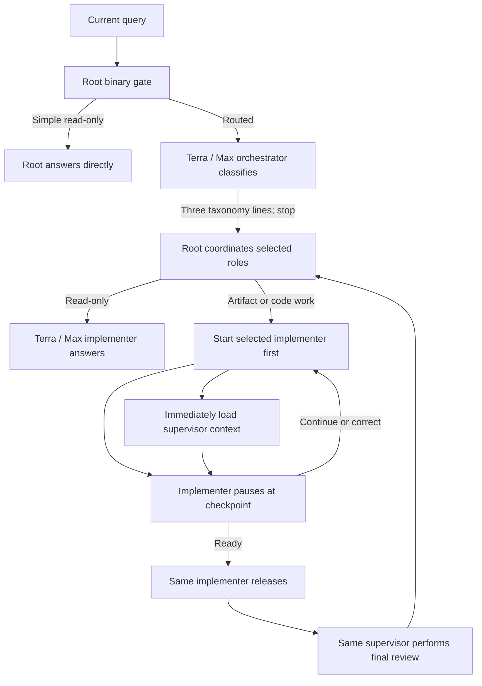

# Codex Orchestration

Codex Orchestration routes Codex work by job type and keeps classification, implementation, and
read-only review as separate roles. Version `0.10.2` uses an outcome-based taxonomy that separates
non-code artifacts from code changes and makes the selected models visible throughout startup. The
Terra / Max orchestrator remains taxonomy-only: it reads the current query plus bounded
conversational continuity, returns the route to root, and stops.
Terra / Max remains independently available as an implementer and as a supervisor.

The six work classes are `READ_ONLY`, `STANDARD_ARTIFACT`, `DESIGN_ARTIFACT`, `SMALL_TWEAK`,
`BIG_TWEAK`, and `BUILD`. Complexity is diagnostic telemetry; it never selects a model.

## How 0.10.2 works

1. The stable chat-scoped hook gives root a binary gate, the current query, the latest bounded
   acceptance or completion capsule, and a short window of newer conversation. App-injected plugin,
   project-instruction, and environment wrappers are removed from stored user messages.
2. Root answers a simple explanation, summary, status, rationale, or brief brainstorming request
   directly in root when it needs no mutation, tools, fresh verification, audit, or substantial
   research.
3. All other work starts the GPT-5.6 Terra / Max orchestrator on the standard service tier. The
   orchestrator receives only the query and bounded continuity. It does not receive workspace
   dependencies, task-specific skill instructions, repository contents, or a work plan. It calls no
   tools, performs no task work, and returns only the relationship, fixed route, and concrete
   classification reason.
4. Root validates that fixed route mechanically. Only after classification, root calls the bundled
   workspace dependency loader when spreadsheet, presentation, document, or PDF work needs it. The
   exact executable and package paths go directly to the task roles, never back to the orchestrator.
5. For artifact and code work, root starts the selected implementer first and immediately starts the
   selected read-only supervisor second. The implementer begins the first routed checkpoint while
   the supervisor's tool-free initial turn loads the same detailed request and defines immutable
   acceptance. The orchestrator is already finished.
6. Only those context-loading turns overlap. The implementer pauses at a quiescent checkpoint
   before the supervisor uses tools or inspects workspace state. Root then serially reactivates the
   supervisor for review and the same implementer with `CONTINUE`, `CORRECT`, or
   `READY_TO_RELEASE`, always including the immutable acceptance.
7. The same supervisor performs final review and writes the readable completion report. Root omits
   the private continuity capsule and returns the report unchanged. Root never classifies,
   implements, supervises, or judges acceptance.

For routed work, every child pill starts with the selected model lane rather than the work class.
After supervisor readiness, root names the class, gives the classifier's concrete reason, and names
the dynamic implementation and supervision models. It otherwise reports only meaningful
milestones: checkpoint decisions, release authorization, blockers, and completion.
It waits until an agent update instead of polling and does not emit elapsed-time heartbeats.
The persistent desktop reasoning summary remains the single generic word `Thinking`; internal
routing, request, wait, relay, checkpoint, and acceptance details are never used as that label.

## Work classes and routes

| Work class | Definition | Implementer | Read-only supervisor | Checkpoints |
|---|---|---|---|---|
| `READ_ONLY` | Fresh verification, audit, substantial research, or a read-only request root cannot answer directly | Terra / Max | None | None |
| `STANDARD_ARTIFACT` | Create or edit a non-code deliverable where content, data, formulas, structure, and ordinary professional formatting matter more than a distinctive visual treatment | Luna / Max | Terra / Max | Release candidate |
| `DESIGN_ARTIFACT` | Create or edit a non-code deliverable where visual composition, brand expression, storytelling, or exact look and feel is a defining outcome | Terra / Max | Terra / Max | Release candidate |
| `SMALL_TWEAK` | Change one existing behavior in one production component | Luna / Max | Terra / Max | Release candidate |
| `BIG_TWEAK` | Change multiple existing behaviors, or change existing behavior across components, an interface/runtime boundary, or material operational risk | Terra / Max | Sol / High | Root cause, release candidate |
| `BUILD` | Add any net-new code capability, regardless of component count | Sol / High | Sol / Extra High | Architecture, vertical slice, release candidate |

Writing an artifact is a mutation, but it is not a code tweak or build. Specific formulas do not
make a spreadsheet a design artifact. A design artifact is distinguished by appearance being a
defining outcome. UI work inside an app or website is code: changing existing UI behavior is a
tweak, while adding a new UI capability is a build. Tests, documentation, generated metadata, and
routine release steps do not change the defining class. Ambiguity routes upward.



The three Terra / Max identities are roles, not model restrictions:

- `codex_orchestration_terra_orchestrator` classifies taxonomy only.
- `codex_orchestration_terra_implementer` performs read-only work, design artifacts, and big tweaks.
- `codex_orchestration_terra_supervisor` reviews artifacts and tweaks read-only.

## Context continuity

The orchestrator classifies a new query as `NEW`, `AMEND`, `REPLACE`, or `CANCEL`. Unfinished work
remains active unless the newest request explicitly replaces or cancels it. An interrupted turn
stops execution, not the objective.

The hook passes a bounded completion capsule and recent conversation rather than replaying a large
completed rollout. A newer direct conversation marks an older capsule stale. Commands such as “do
the next step” must resolve to an exact recent decision; repository plans cannot invent a missing
referent. This supports multiple orchestration requests in one ongoing task without reloading an
hour-long transcript.

The supervisor—not the orchestrator—defines concrete outcomes, destinations, proof, and open
commitments during its context-only initial turn. The implementer may start the first checkpoint
from the exact request and fixed route, but cannot release before the supervisor is ready. The
accepted contract then stays immutable through implementation and supervision.
When work completes, the supervisor records a private one-line capsule containing the outcome,
delivered capabilities, decisive proof, links, revision, open commitments, next work, and
limitations. A follow-up asking what was just built can use that capsule without rereading the
completed rollout.

## Checkpoints and readable output

An implementer checkpoint has a compact machine-readable first line followed by Markdown sections
for state, changes, evidence, next work, and blockers. Supervisor readiness and decisions similarly
use readable acceptance, findings, required corrections, and evidence sections.

The supervisor is strictly read-only. A correction must identify an observed mismatch and give a
bounded, outcome-focused instruction. Root relays the exact decision to the same implementer. Only
`READY_TO_RELEASE` at the release-candidate checkpoint authorizes commit, push, deployment, and the
final probe.

## UI and experience verification

Frontend files do not automatically require visual review. Ordinary UI work uses the narrowest
decisive code, test, artifact, runtime, and deployed-revision evidence.

The supervisor prefixes proof with `ROOT_EXPERIENCE:` only when acceptance depends on a user-facing
interaction, rendered appearance, explicit visual review, or recovery input/output. Root then
performs one bounded root-only Browser/visual check against the live URL or rendered artifact,
cache-bypassed and at the requested viewport. It records the defining `START`, `ACTION`, `RESULT`,
and artifacts and gives those raw observations back to the supervisor. Root observes but never
judges acceptance.

## Controls

Activate one task with any of:

- `Turn Orchestration on`
- `Use Orchestration`
- `Use Orchestration for this chat`

Use `Turn Orchestration off` or `Orchestration off` to disable it. A combined command such as
`Turn Orchestration on and add CSV export` activates and routes that prompt. Each new task starts
with Orchestration off.

After installing 0.10.2, Orchestration can be activated on the next prompt inside an ongoing task.
Root uses each custom role when available and otherwise a model-pinned built-in `default` or
`worker` loaded with the corresponding installed profile. Subagents share a parent session ID, so
the hook checks role metadata and does not recursively orchestrate a child.

## Final completion receipt

Every accepted change ends with a supervisor-authored Markdown report that root relays unchanged.
It describes the outcome, major changes, decisive verification, exact links, release identity,
remaining commitments, and route. A result can say work is live, deployed, released, or on GitHub
only when it includes the exact destination and evidence. `Remaining: None` is allowed only when
every acceptance requirement and open commitment is complete.

## Install from GitHub

Requirements:

- Current Codex CLI or ChatGPT desktop app with plugins and native subagents enabled.
- Access to GPT-5.6 Sol, Terra, and Luna.
- `jq`, Python 3, and standard Unix checksum tools.

```sh
codex plugin marketplace add jessejaffe/codex-orchestration --ref main
codex plugin add codex-orchestration@codex-orchestration
```

Install the seven companion profiles:

```sh
plugin_dir="$(codex plugin list --json | jq -r '.installed[] | select(.pluginId == "codex-orchestration@codex-orchestration") | .source.path')"
sh "$plugin_dir/scripts/install-agents.sh"
sh "$plugin_dir/scripts/install-agents.sh" --check
```

The role installer preflights the complete update. It installs the seven current profiles, removes
only recognized byte-for-byte obsolete profiles, and refuses to overwrite or delete customized
files.

Install the stable user-level hook:

```sh
python3 "$plugin_dir/scripts/install-user-hook.py" --plugin-dir "$plugin_dir"
python3 "$plugin_dir/scripts/install-user-hook.py" --check --plugin-dir "$plugin_dir"
```

## Versioning and upgrades

The project uses traditional semantic versions without timestamp suffixes:

- Patch releases contain compatible fixes and refinements.
- Minor releases such as `0.9.x` to `0.10.0` add backward-compatible capabilities.
- Major releases change compatibility expectations.

Version `0.10.0` introduced the six-class artifact/tweak/build taxonomy. Version `0.10.1` restored
implementer-first startup, model-led child names, and a concrete classification reason in the
dynamic route message. Version `0.10.2` keeps those behaviors and makes the persistent root
reasoning summary the generic `Thinking` label. The standard checkout workflow is:

```sh
sh plugins/codex-orchestration/scripts/verify.sh
sh plugins/codex-orchestration/scripts/reinstall-plugin.sh
sh plugins/codex-orchestration/scripts/reinstall-plugin.sh --check
```

The reinstaller installs the exact manifest version, refreshes recognized cache copies, updates the
seven companion profiles, updates the stable user hook, and verifies installed state. This is a
local Codex plugin, so local reinstall is its deployment; it needs no Hetzner or database access.

## Development

Run the offline release suite with:

```sh
sh plugins/codex-orchestration/scripts/verify.sh
```

The suite validates the manifest, syntax, exact model pins, chat controls, bounded continuity, the
classifier-only role boundary, implementer-before-supervisor startup, context-only overlap,
model-led child names, dynamic class reasons and route labels, the six-class route, root-only
experience verification, same-implementer corrections, fixtures, effectiveness tracking, and
conflict-safe cleanup. It also locks the root reasoning display to `Thinking` and rejects the
previous internal routing phrase.

The offline classification fixture is
`plugins/codex-orchestration/scripts/triage-cases.json`. It covers all six classes plus amendment,
replacement, cancellation, and interrupted-work continuity.

## Repository

- Maintained repository: `jessejaffe/codex-orchestration`
- Original project: `DannyMac180/sol-advisor`
- License: MIT
