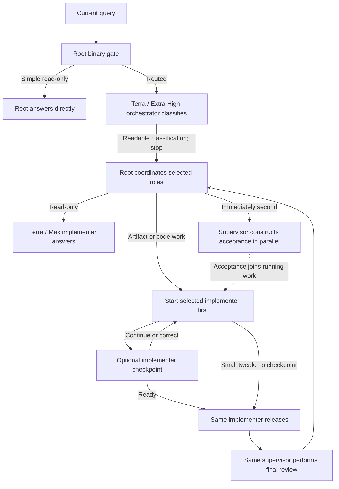

# Codex Orchestration

Codex Orchestration routes Codex work by job type and keeps classification, implementation, and
read-only review separate. Version `0.12.8` groups closely related, low-output inspections when they
answer one immediate question, while keeping unrelated or noisy checks separate. The compact route
footer remains on every completed orchestration task. Work starts from the
working copy left by the previous task and moves its one GitHub comparison to the release boundary.
The Terra / Extra High orchestrator only classifies; root derives the fixed route. Small tweaks use
Luna / High implementation and Terra / High supervision. The six-field acceptance contract remains
unchanged.

The seven work classes are `READ_ONLY`, `STANDARD_ARTIFACT`, `DESIGN_ARTIFACT`, `SMALL_TWEAK`,
`BIG_TWEAK`, `SMALL_BUILD`, and `BIG_BUILD`. Complexity is diagnostic telemetry; it never selects a model.

## How 0.12.8 works

1. The chat-scoped hook writes a private exact bundle for the current objective and gives root only
   bounded routing continuity. Runtime wrappers are excluded.
2. When the user explicitly asks to read the last task, root reads the newest relevant task once.
   The classifier receives a routing capsule of at most 1,200 characters; the supervisor and
   implementer receive a continuity block of at most 6,000 characters.
   Every task-role packet tells the role to group closely related, low-output inspections for one
   immediate question in one pass and to keep unrelated or noisy checks separate.
3. Root answers a simple explanation or brief brainstorming request directly only when it needs no
   tools, mutation, fresh verification, audit, or substantial research. All other work is classified
   by Terra / Extra High, which only classifies. Root derives models and checkpoints from the class.
   Every completed direct or routed response ends with the same compact route footer.
4. For change work, root starts the selected implementer first and the supervisor immediately next.
   The implementer begins while the supervisor constructs acceptance.
5. Before acceptance, the implementer does not commit or deploy. If it finishes first, it returns
   `Awaiting acceptance`; root joins the two parallel paths.
6. The implementer uses the working copy as given. Once implementation and verification are ready,
   it fetches GitHub once, integrates remote movement, and releases. Small tweaks have no
   implementer checkpoint. Big tweaks have one release-candidate review. Builds retain architecture
   and vertical-slice checkpoints where applicable. Every release candidate includes an executable release plan.
7. If the user's request changes, root stops or redirects work that no longer matches it. The same
   supervisor performs final review and writes the readable completion report.

For routed work, every child pill starts with the selected model lane rather than the work class.
At role startup, root names the class, gives the classifier's concrete reason, and names the dynamic
implementation and supervision models. It otherwise reports only meaningful
milestones: checkpoint decisions, release authorization, blockers, and completion.
It waits until an agent update instead of polling and does not emit elapsed-time heartbeats.
The gray desktop activity summary stays exactly `Thinking` throughout orchestration. It never turns
an internal plan, repository action, deployment question, agent state, or checkpoint into a
persistent label.
Classifications, implementer checkpoints and release results, supervisor decisions, continuity
summaries, and final reports all use readable Markdown headings and labeled bullets. Raw field
dumps are never shown in a child response. After approval, the release turn executes the prepared
plan.

## Work classes and routes

| Work class | Definition | Implementer | Read-only supervisor | Implementer checkpoints |
|---|---|---|---|---|
| `READ_ONLY` | Fresh verification, audit, substantial research, or a read-only request root cannot answer directly | Terra / Max | None | None |
| `STANDARD_ARTIFACT` | Create or edit a non-code deliverable where content, data, formulas, structure, and ordinary professional formatting matter more than a distinctive visual treatment | Luna / High | Terra / High | Release candidate |
| `DESIGN_ARTIFACT` | Create or edit a non-code deliverable where visual composition, brand expression, storytelling, or exact look and feel is a defining outcome | Terra / Max | Terra / High | Release candidate |
| `SMALL_TWEAK` | Change one existing behavior in one production component | Luna / High | Terra / High | None |
| `BIG_TWEAK` | Change multiple existing behaviors, or change existing behavior across components, an interface/runtime boundary, or material operational risk | Terra / Max | Sol / High | Release candidate |
| `SMALL_BUILD` | Add one bounded new capability inside one existing component without a new interface, runtime, or storage boundary | Terra / Max | Sol / High | Architecture, release candidate |
| `BIG_BUILD` | Add multiple new capabilities, or add a capability across components, an interface/runtime/storage boundary, or material operational risk | Sol / High | Sol / Extra High | Architecture, vertical slice, release candidate |

Writing an artifact is a mutation, but it is not a code tweak or build. Specific formulas do not
make a spreadsheet a design artifact. A design artifact is distinguished by appearance being a
defining outcome. UI work inside an app or website is code: changing existing UI behavior is a
tweak, while adding a new UI capability is a build. A component-local capability can be a small
build; a boundary-crossing or multi-capability feature is a big build. Tests, documentation,
generated metadata, and routine release steps do not change the defining class. Ambiguity routes upward.



The Terra identities are roles, not model restrictions:

- `codex_orchestration_terra_orchestrator` classifies taxonomy only at Extra High reasoning.
- `codex_orchestration_terra_implementer` performs read-only work, design artifacts, and big tweaks.
- `codex_orchestration_terra_supervisor` reviews artifacts and tweaks read-only.

## Context continuity

The orchestrator classifies the relationship as `NEW`, `AMEND`, `REPLACE`, or `CANCEL` and assigns
one of the seven work classes. Root derives the model route and checkpoints from that class.

The classifier inherits only the current root turn and receives compact routing continuity. Task
roles receive a private JSON bundle containing the exact current objective. An explicit request to
read the last chat makes root produce two previous-task payloads from one read: the orchestrator gets
only the 1,200-character routing capsule, while the supervisor and implementer get the fuller
6,000-character continuity block. If the user's request changes, root stops or redirects work that
no longer matches it. Missing optional artifacts never block work.

The supervisor—not the orchestrator—defines concrete outcomes, destinations, proof, and open
commitments during its initial turn. The implementer starts first and makes reversible local progress
while that full-context acceptance is constructed. Acceptance becomes binding when delivered;
commit and deployment remain gated by it.
When work completes, the supervisor records a private readable continuity section containing the outcome,
delivered capabilities, decisive proof, links, revision, open commitments, next work, and
limitations. A follow-up asking what was just built can use that capsule without rereading the
completed rollout.

## Repository synchronization

For each mutation objective, the implementer starts from the working copy left by the previous task.
After implementation and verification are ready, it records one release baseline with a GitHub
fetch, integrates remote movement while preserving current work, and proceeds to the accepted
commit, push, and deployment. Read-only research and brainstorming never commit or deploy.

## Checkpoints and readable output

Acceptance construction remains the first supervisory judgment for every change, but it no longer
blocks implementation startup. Small tweaks have no implementer checkpoint and go directly to final
review after acceptance and release, for two gates total. Big tweaks have one
release-candidate checkpoint before final review, for three gates total. An implementer checkpoint
uses a `Checkpoint` heading plus state, changes, evidence, release plan, next work, and blockers.

The supervisor is strictly read-only. A correction must identify an observed mismatch and give a
bounded instruction. Root relays it to the same implementer. Release-candidate routes require
`READY_TO_RELEASE`; a small tweak is already authorized by its accepted contract to complete the
requested commit, push, deployment, and probe before final review.

## UI and experience verification

Frontend files do not automatically require visual review. Ordinary UI work uses the narrowest
decisive code, test, artifact, runtime, and deployed-revision evidence.

The supervisor starts proof with `Root experience check required` only when the requested outcome
depends on a user-facing interaction, rendered appearance, or explicit visual review. A ZIP,
competitor, recovery input, screenshot, or sample mentioned as background does not become proof by
itself. Root then
performs one bounded root-only Browser/visual check against the live URL or rendered artifact,
cache-bypassed and at the requested viewport. It records the defining start, action, result, and
artifacts in labeled bullets and gives those observations back to the supervisor. Root observes but never
judges acceptance.

## Controls

Activate one task with any of:

- `Turn Orchestration on`
- `Use Orchestration`
- `Use Orchestration for this chat`

Use `Turn Orchestration off` or `Orchestration off` to disable it. A combined command such as
`Turn Orchestration on and add CSV export` activates and routes that prompt. Each new task starts
with Orchestration off.

After installing 0.12.8, Orchestration can be activated on the next prompt inside an ongoing task.
Root uses each custom role when available and otherwise a model-pinned built-in `default` or
`worker` loaded with the corresponding installed profile. Subagents share a parent session ID, so
the hook checks role metadata and does not recursively orchestrate a child.

## Final completion receipt

Every completed orchestration task ends with a compact route footer naming its class,
implementation lane, supervision lane or `None`, and root lane. Root direct answers and routed
read-only tasks use the same receipt as supervisor-authored change reports. Change reports also
describe the outcome, major changes, decisive verification, exact links, release identity, and
remaining commitments. A result can say work is live, deployed, released, or on GitHub only when
it includes the exact destination and evidence. `Remaining: None` is allowed only when every
acceptance requirement and open commitment is complete.

## Install from GitHub

Requirements:

- Current Codex CLI or ChatGPT desktop app with plugins and native subagents enabled.
- Access to GPT-5.6 Sol, Terra, and Luna.
- `jq`, Python 3, and standard Unix checksum tools.

```sh
codex plugin marketplace add jessejaffe/codex-orchestration --ref main
codex plugin add codex-orchestration@codex-orchestration
```

Install the seven companion profiles:

```sh
plugin_dir="$(codex plugin list --json | jq -r '.installed[] | select(.pluginId == "codex-orchestration@codex-orchestration") | .source.path')"
sh "$plugin_dir/scripts/install-agents.sh"
sh "$plugin_dir/scripts/install-agents.sh" --check
```

The role installer preflights the complete update. It installs the seven current profiles, removes
only recognized byte-for-byte obsolete profiles, and refuses to overwrite or delete customized
files.

Install the stable user-level hook:

```sh
python3 "$plugin_dir/scripts/install-user-hook.py" --plugin-dir "$plugin_dir"
python3 "$plugin_dir/scripts/install-user-hook.py" --check --plugin-dir "$plugin_dir"
```

## Versioning and upgrades

The project uses traditional semantic versions without timestamp suffixes:

- Patch releases contain compatible fixes and refinements.
- Minor releases such as `0.9.x` to `0.10.0` add backward-compatible capabilities.
- Major releases change compatibility expectations.

Version `0.10.0` introduced the artifact/tweak/build taxonomy. Version `0.10.1` restored
implementer-first startup, model-led child names, and a concrete classification reason in the
dynamic route message. Version `0.10.2` keeps those behaviors and makes the persistent root
reasoning summary the generic `Thinking` label. Version `0.10.3` makes all detailed role output
readable and moves deployment discovery into a supervised release plan, leaving the release turn
as bounded execution. Version `0.10.4` replaces the brittle fixed reasoning label with short live
milestones and a `Thinking` fallback, inherits the current query once instead of regenerating it in
every packet, emits both initial role launches together in implementer-first order, and minimizes
later relays. Version `0.10.5` moves the classifier to Terra / Extra High and gives task roles one
private, versioned, exact context bundle. Initial role launches use small reference packets, and an
interruption updates the same roles and acceptance rather than clipping or recopying the original
request. Version `0.11.0` splits new capabilities into `SMALL_BUILD` and `BIG_BUILD`: contained
single-capability work uses Terra / Max with Sol / High supervision, while boundary-crossing or
multi-capability work retains Sol / High with Sol / Extra High supervision. Version `0.11.1`
removes the remaining raw routing and continuity field dumps from every child response. The
classifier, implementers, and supervisors now communicate through compact human-readable Markdown,
while the continuity reader remains backward-compatible with earlier task transcripts. Version
`0.12.0` adds explicit previous-task retrieval, acceptance-before-implementation sequencing,
optional-artifact boundaries, one baseline GitHub sync per mutation objective, no implementer
checkpoint for small tweaks, and only a release-candidate checkpoint for big tweaks. It also adds
hard prompt-size budgets after cutting the role prompts by about half. Version `0.12.1` splits that
prior-task handoff so the classifier receives only a compact structured routing capsule and task
roles retain the fuller continuity. Version `0.12.2` restores implementer-first startup: root launches
the implementer and then the supervisor back-to-back, so reversible local work overlaps full-context
acceptance construction while release and irreversible actions remain gated. Version `0.12.3`
recovers matching stopped-run edits before considering worktree isolation and makes `Thinking` the
only desktop activity label. Version `0.12.4` removes incident-specific prompt rules, reduces the
classifier to classification, moves route derivation to root, and keeps only four compact dependency
rules for context loading, acceptance joining, route derivation, and changed work. Version `0.12.5`
removes the negative acceptance field, leaving one positive `Must` list alongside outcome,
destinations, open commitments, and proof. Version `0.12.6` moves GitHub synchronization from
startup to the release boundary and gives standard artifacts and small tweaks Luna / High
implementation with Terra / High supervision. Version `0.12.7` restores the compact route footer
across Root direct, routed read-only, artifact, tweak, and build completions. Root-only experience
verification remains unchanged. Version `0.12.8` adds bounded inspection grouping across read-only,
implementation, and supervision tasks without combining unrelated questions or noisy output.
The standard
checkout workflow is:

```sh
sh plugins/codex-orchestration/scripts/verify.sh
sh plugins/codex-orchestration/scripts/reinstall-plugin.sh
sh plugins/codex-orchestration/scripts/reinstall-plugin.sh --check
```

The reinstaller installs the exact manifest version, refreshes recognized cache copies, updates the
seven companion profiles, updates the stable user hook, and verifies installed state. This is a
local Codex plugin, so local reinstall is its deployment; it needs no Hetzner or database access.

## Development

Run the offline release suite with:

```sh
sh plugins/codex-orchestration/scripts/verify.sh
```

The suite validates the manifest, syntax, exact model pins, chat controls, current-task bundles,
bounded classifier continuity, previous-task lookup, acceptance-gated release safety,
implementer-first launch ordering, a fixed `Thinking` activity label, reduced tweak checkpoints,
root-only experience checks, readable Markdown, effectiveness tracking, and conflict-safe upgrades.
Hard budgets keep the root dispatch prompt below 7,500 characters and all seven role prompts below
19,000 characters total.

The offline classification fixture is
`plugins/codex-orchestration/scripts/triage-cases.json`. It covers all seven classes plus amendment,
replacement, cancellation, and interrupted-work continuity.

## Repository

- Maintained repository: `jessejaffe/codex-orchestration`
- Original project: `DannyMac180/sol-advisor`
- License: MIT
