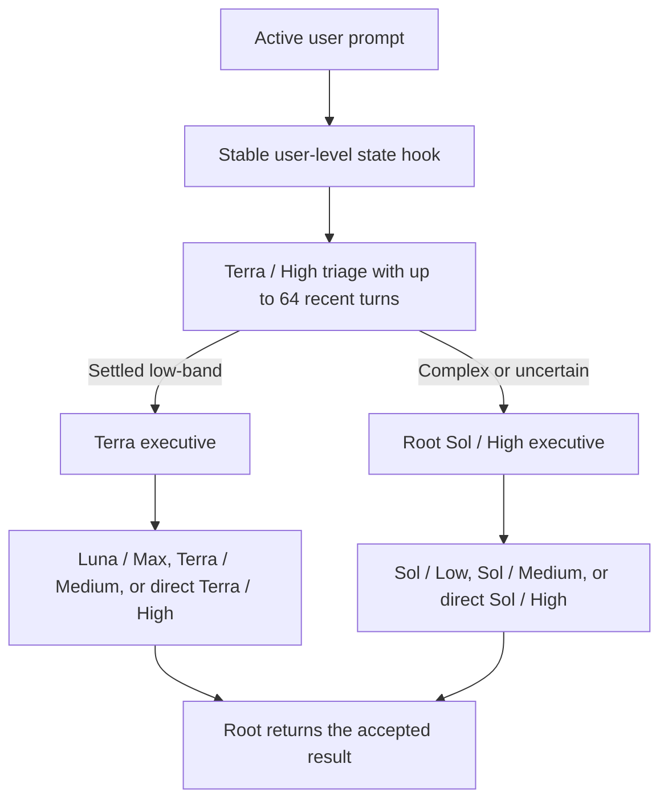

# Codex Orchestration

Codex Orchestration saves Codex credits by moving settled work to the least expensive
capable model while keeping complex executive judgment with GPT-5.6 Sol / High.

The 0.8.0 release replaces the former skill-driven router with a minimal, recent-context
fast path. The manifest does not advertise a skill, so no Orchestration skill or
versioned skill locator is injected into a new task. Activation no longer makes the
model calculate a decimal score, scan the transcript before every tool, construct a
handoff summary, or call a finish-time receipt tool.

## Runtime architecture

The active path is intentionally small:

1. A stable user-level, once-per-prompt hook checks one chat-local boolean.
2. Root Sol immediately gives the current request and up to 64 recent turns to Terra /
   High with a constant prompt.
3. Terra conservatively decides only whether the request is low-band or complex.
4. Low-band work stays with Terra as executive. Complex work returns untouched to
   root Sol / High, which owns architecture and acceptance.
5. Root returns the result with the observed executive and implementation lanes.

Spawned-task labels begin with the exact selected model and effort (`GPT 5 6 Terra
High`, `GPT 5 6 Luna Max`, `GPT 5 6 Terra Medium`, `GPT 5 6 Sol Low`, or `GPT 5 6 Sol
Medium`), so the model choice remains visible in the Codex activity stream without
another model call or reporting step.

Terra is the triage gate, not the executive for complex work. It may own settled,
bounded work and choose Luna / Max, Terra / Medium, or direct Terra / High. It must
return immediately for uncertain architecture, deep diagnosis, broad unfamiliar-repo
work, cross-system coordination, security or authorization judgment, high-stakes
advice, or irreversible data/schema changes. Root Sol / High may then use Sol / Low,
Sol / Medium, or direct Sol / High, while retaining executive ownership.

Both handoffs inherit up to 64 recent turns. This bounded history is used because
current Codex rejects a custom-model role combined with a
literal full-history fork. The router does not reconstruct requirements into a lossy
packet, so active corrections, constraints, permissions, and repository context stay
available to the selected model.



The producer self-checks. The owning executive checks once and may send one precise
correction to the same producer. There is no automatic reviewer chain or replacement
producer loop.

## Controls

Activate a chat with any command below, either by itself or at the start of an
imperative line that also contains work:

- `Turn Orchestration on`
- `Use Orchestration`
- `Use Orchestration for this chat`

Activation persists only in that chat. Use `Turn Orchestration off` or
`Orchestration off` to disable it. Combined forms such as `Turn Orchestration on,
remove the hero subtitle` activate and route the same prompt; combined off commands
disable routing and continue the remaining work directly. Every new chat starts off.

Activation is handled only by the prompt hook. The dispatch contract explicitly
forbids checking, comparing, or updating Orchestration during user work; a
version-looking cache directory is a compatibility locator, not version evidence.

## Usage measurement

Every completed task reports the observed executive and implementation lanes:

```text
Executive design and review: GPT-5.6 Terra / High
Implementation: GPT-5.6 Terra / Medium
```

There is deliberately no automatic savings receipt. Producing one requires transcript
discovery and pricing work, while Stop enforcement requires another model
continuation. A post-wait hook also runs after timed-out waits, so it can repeat that
cost while an agent is still working. All of those operations are excluded from the
runtime path.

For an explicit diagnostic, the bundled receipt helper can still produce a
weekly-calibrated comparison or an official-rate fallback:

```text
Estimated task credits: 20.000 credits
All-Sol equivalent credits: 50.000 credits
Estimated routing savings: 60.00%
```

The diagnostic uses recorded task and descendant usage. Same-token public pricing cannot
prove the savings from Sol Low versus Sol Medium or Sol High because hidden reasoning
credits are not fully observable. The receipt therefore does not claim that equal
public rates mean equal actual credit consumption.

## Offline routing evaluation

`scripts/triage-cases.json` is a release-time benchmark for the dangerous boundary:
under-routing complex work to Terra is a correctness failure; conservatively returning
a low-band case to Sol is measurable overhead.
The runtime never reads the offline routing benchmark, so it adds zero task latency and zero task tokens.

## Install from GitHub

Requirements:

- Current Codex CLI or ChatGPT desktop app with plugins and native subagents enabled.
- Access to the GPT-5.6 Sol, Terra, and Luna lanes used by the role templates.
- `jq` for installation and verification scripts.

Add the repository as a marketplace and install the plugin:

```sh
codex plugin marketplace add jessejaffe/codex-orchestration --ref main
codex plugin add codex-orchestration@codex-orchestration
```

Install the eight native companion roles separately. The installer never overwrites a
different user-owned role file:

```sh
plugin_dir="$(codex plugin list --json | jq -r '.installed[] | select(.pluginId == "codex-orchestration@codex-orchestration") | .source.path')"
sh "$plugin_dir/scripts/install-agents.sh"
sh "$plugin_dir/scripts/install-agents.sh" --check
```

Install the single stable user-level hook. The installer preserves unrelated hooks,
copies the two tiny runtime files to `~/.codex/orchestration`, and records trust only
for the exact installed definition:

```sh
python3 "$plugin_dir/scripts/install-user-hook.py" --plugin-dir "$plugin_dir"
python3 "$plugin_dir/scripts/install-user-hook.py" --check --plugin-dir "$plugin_dir"
```

Open one new task after this first install so Codex includes the user config layer.
Later releases update the scripts behind the same trusted command path, so existing
Orchestration-capable tasks and every new task use the current code without a desktop
restart, settings navigation, skill reload, or version check during user work.

## Upgrade safely

From a repository checkout, run:

```sh
python3 ~/.codex/skills/.system/plugin-creator/scripts/update_plugin_cachebuster.py plugins/codex-orchestration
sh plugins/codex-orchestration/scripts/verify.sh
sh plugins/codex-orchestration/scripts/reinstall-plugin.sh
sh plugins/codex-orchestration/scripts/reinstall-plugin.sh --check
```

Every update uses a unique cache-busted version such as
`0.8.0+codex.20260805152715`. This is the supported mechanism that prevents a newly
created task from retaining stale plugin metadata. The reinstaller requires the
complete package, installs that exact version, retains complete compatibility cache
aliases, unconditionally clears orphaned legacy plugin enablement, and refuses unsafe
or incomplete cache entries. It then atomically refreshes the stable user-level hook
runtime and proves that the exact hook is enabled and trusted. The plugin itself no
longer bundles a versioned hook, and the installer checks the user hook from both the
plugin project and a separate user scope. The running desktop's plugin registry cannot
leave new tasks on an older routing definition.

The updater never opens settings, sends keystrokes, steals focus, or restarts Codex.
Once the stable hook definition is installed, later releases keep that definition and
replace only the script it calls. There is no update-time desktop refresh and no
runtime version-discovery step.

## Measure effectiveness

The on-demand receipt is a narrow same-token counterfactual. For longitudinal account
measurement, establish a baseline:

```sh
plugin_dir="$(codex plugin list --json | jq -r '.installed[] | select(.pluginId == "codex-orchestration@codex-orchestration") | .source.path')"
python3 "$plugin_dir/scripts/effectiveness-tracker.py" baseline
```

Later, report the experiment:

```sh
python3 "$plugin_dir/scripts/effectiveness-tracker.py" report
```

The tracker preserves compatibility with the former `sol_advisor_completion_metrics`
schema. Experiment state lives under Codex state, not inside the replaceable plugin
cache.

## Development

The repository verifier runs syntax, role-pin, hook behavior, latency-budget,
continuity, telemetry-migration, safe-installer, and offline-boundary tests:

```sh
sh plugins/codex-orchestration/scripts/verify.sh
```

The prompt hook has a 2 KB injected-context ceiling and the hermetic latency test gives
its subprocess a generous 100 ms average CI budget. These are release checks only;
they are not additional runtime work.

The daily upstream workflow compares this maintained fork with
`DannyMac180/sol-advisor` and may open or update a review issue. It never merges or
pushes upstream changes automatically.

## Repository

- Maintained fork: `jessejaffe/codex-orchestration`
- Original project: `DannyMac180/sol-advisor`
- License: MIT
