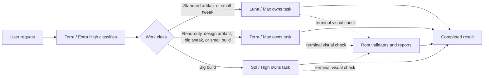

# Codex Orchestration

Codex Orchestration `0.13.0` is a two-stage experiment:

1. GPT-5.6 Terra / Extra High classifies the request.
2. One selected agent owns the task end to end.

The prior multi-role orchestration system remains preserved on `main`. This branch removes
supervisors, acceptance construction, implementation checkpoints, and final-review loops so the
single selected agent can interpret scope, work, verify, release when authorized, and report the
result without serial coordination overhead.

## Workflow



There is exactly one task agent after classification. It never spawns another agent.

## Routes

| Work class | Definition | End-to-end agent |
|---|---|---|
| `READ_ONLY` | Research, diagnosis, review, explanation, or status without mutation | Terra / Max |
| `STANDARD_ARTIFACT` | Content- or data-led spreadsheet, document, PDF, or presentation work | Luna / Max |
| `DESIGN_ARTIFACT` | A non-code artifact whose composition, brand, or exact look defines success | Terra / Max |
| `SMALL_TWEAK` | One bounded existing behavior with predictable blast radius | Luna / Max |
| `BIG_TWEAK` | Multiple existing behavior changes, a boundary crossing, or material operational risk | Terra / Max |
| `SMALL_BUILD` | One bounded new capability without a new interface, runtime, or storage boundary | Terra / Max |
| `BIG_BUILD` | Multiple new capabilities, a boundary-crossing capability, or material risk | Sol / High |

Complexity remains diagnostic telemetry. Root derives the fixed agent route from the classified work
class.

## What the selected agent owns

The selected agent receives the exact private task-context bundle and then:

- resolves the requested outcome and constraints;
- inspects the real project state;
- uses applicable skills;
- performs the full read-only, artifact, tweak, or build task;
- runs proportionate verification;
- commits, pushes, or deploys only when the user request, project instructions, or active
  continuity clearly authorizes that exact destination;
- writes the continuity capsule and a complete final result covering current state, with a next
  step only when one is legitimately warranted.

A request to implement locally does not itself authorize deployment.

The agent does not wait for acceptance, stop at architecture or release-candidate checkpoints, or
send its work through a supervisor. User questions and blockers still stop the task when a decision
is genuinely required.

## Root-only visual evidence

Visual validation is the only terminal handoff. It is required when the defining outcome depends on
rendered appearance, user interaction, a reported visual mismatch, or explicit visual review—not
merely because UI files changed. The selected agent prepares an accessible target and returns:

```text
## Root verification needed
- Requirement: ...
- Ground truth: ...
- Source: ...
- Check: ...
- Targets: ...
- Viewport: ...
- State: ...
- Work report: ...
```

Root checks once, validates the rendered result against the request and cited ground truth, and ends
the task with the standard report whether the result passes, fails, or is blocked. It never guesses
an ambiguous identity, description, or link, and never hands the check back for another agent cycle.
The work performed remains the report's primary content; a visual failure is one short limitation,
mentioned only as the second Next step after the actual work next step or its `None —` reason.

## Classification and continuity

The chat-scoped hook writes an immutable, private task-context bundle. Terra / Extra High receives
only bounded routing context and returns:

```text
## Classification
- Relationship: New|Amend|Replace|Cancel
- Active objective: ...
- Work class: Read-only|Standard artifact|Design artifact|Small tweak|Big tweak|Small build|Big build
- Complexity: 1.0-10.0 / 10
- Why: ...
```

When the user explicitly asks to continue a previous task, root reads it once. The classifier gets a
1,200-character routing capsule and the selected implementer gets a 6,000-character continuity
block. Missing optional artifacts never block work.

Completed agents return a compact continuity section before the user-facing answer, so a follow-up
can recover the prior outcome without flooding the main context.

## Reports

The final report keeps the continuity section, followed by substantive Current state and Next step
sections. It has no Recommendations section. Current state explains what exists, what was done or
found, why it matters, and the supporting evidence. Actionable future guidance belongs only in Next
step.

The Next step section gives an evidence-backed action, rationale, and success condition only when a
real follow-on action exists. Otherwise it explicitly says no further action is warranted and why.
The agent never invents work merely to populate that section.

## Premise mismatches

Before editing, the selected agent stops if project evidence contradicts a factual premise in the
request. Root checks only the cited evidence and hands its conclusion back to the same agent. A
confirmed mismatch ends without edits, commit, or deployment; an unconfirmed mismatch resumes in
the same agent thread.

## Activation

Activation is chat-scoped:

```text
Turn Orchestration on
Use Orchestration
Use Orchestration for this chat
```

Disable it with:

```text
Turn Orchestration off
Orchestration off
```

The desktop activity label stays exactly `Thinking`. Startup remains quiet after the activation
acknowledgement; child pills show the classifier and selected agent.

## Route receipt

Every completed task ends with:

```text
## Route
- Class: <friendly class>
- Implementation: <Luna / Max|Terra / Max|Sol / High>
- Supervision: None
- Root: <root model and effort>
```

## Install and verify

Install the four companion profiles:

```sh
plugins/codex-orchestration/scripts/install-agents.sh
```

Run the hermetic verification suite:

```sh
plugins/codex-orchestration/scripts/verify.sh
```

Install or refresh the plugin from the configured local marketplace:

```sh
plugins/codex-orchestration/scripts/reinstall-plugin.sh
```

The installer preflights all four active profiles, migrates exact shipped profiles, retires exact
shipped supervisor identities, and refuses to overwrite customized agent files.

## Repository layout

```text
.agents/plugins/marketplace.json
plugins/codex-orchestration/
  .codex-plugin/plugin.json
  agents/
    codex-orchestration-terra-orchestrator.toml
    codex-orchestration-luna-implementer.toml
    codex-orchestration-terra-implementer.toml
    codex-orchestration-sol-high-implementer.toml
  scripts/
    prompt-router-hook.py
    orchestration_state.py
    install-user-hook.py
    install-agents.sh
    reinstall-plugin.sh
    verify.sh
```

## Design boundary

This branch is intentionally not a general multi-writer system. Parallel exploration, supervision,
and review are outside its execution path. Its evaluation question is narrower: does one strong
classifier plus one accountable end-to-end agent provide a faster and more trustworthy user
experience than the preserved multi-agent design on `main`?
